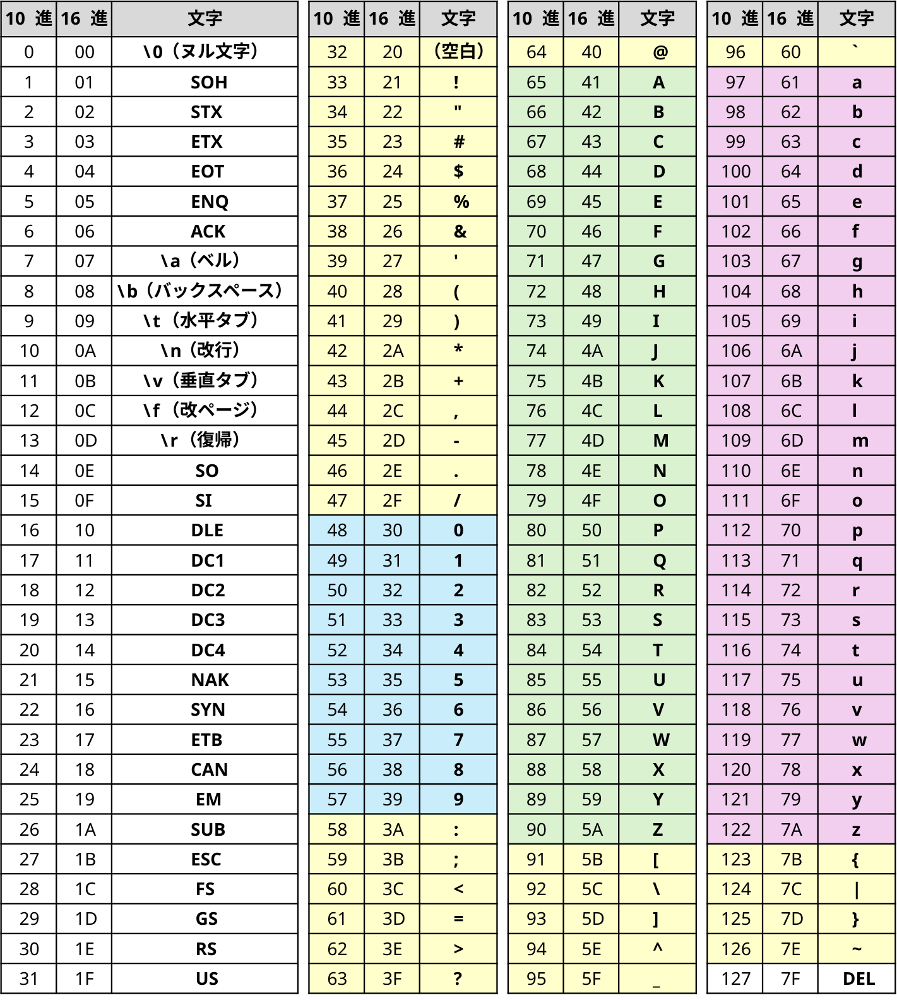

# ASCII コード表

## ASCII コード表

## ASCII コードの重要な性質

### 1. 値の範囲
- ASCII（アスキー）コードは 7 ビットの範囲で表現され、0 から 127 までの整数値を持つ
- 0～31 と 127 は制御文字で、画面に表示されない
    - `'\0'` や `'\t'`, `'\n'` などを除き、通常は直接使用しない 

### 2. 数字やアルファベットの規則性
- 数字の `'0'` から `'9'` までは連続している
- アルファベット大文字の `'A'` から `'Z'` までは連続している
- アルファベット小文字の `'a'` から `'z'` までは連続している

### 3. 小文字と大文字の変換
- アルファベットの大文字に `32` を足すと小文字になる
- アルファベットの小文字から `32` を引くと大文字になる

### 4. 文字と整数値の変換
- 数字から `'0'` を引くと整数値になる（例: `'3' - '0'` は `3`）
- 整数値に `'0'` を足すと数字になる（例: `3 + '0'` は `'3'`）
