# 第 21 章 画像処理（追加のサンプルプログラム）

??? "21.2 画像プログラミングの基本的なコード（クリックで展開）"
	```c title="画像プログラミングの共通コード"
	#include <stdio.h>
	#include <stdlib.h>
	#include <stdint.h>

	// 色（赤、緑、青）を表現する RGB 型
	typedef struct
	{
		double r;
		double g;
		double b;
	} RGB;

	// 画像データを管理する Image 型
	typedef struct
	{
		RGB* pixels; // ピクセルデータ（一次元配列としてまとめて扱う）
		int width; // 画像の幅
		int height; // 画像の高さ
	} Image;

	// 0.0 ～ 1.0 の実数を、0 ～ 255 の整数（1 バイト）に変換する補助関数
	uint8_t ToU8(double x)
	{
		return ((x <= 0.0) ? 0 : (1.0 <= x) ? 255 : (uint8_t)(x * 255.0 + 0.5));
	}

	// 新しい画像を作成し、必要なメモリを確保する関数
	Image* CreateImage(int width, int height)
	{
		if ((width <= 0) || (height <= 0))
		{
			return NULL;
		}

		Image* image = (Image*)malloc(sizeof(Image));
		if (image == NULL)
		{
			return NULL;
		}

		image->width = width;
		image->height = height;
		image->pixels = (RGB*)malloc((size_t)(width * height) * sizeof(RGB));
		if (image->pixels == NULL)
		{
			free(image);
			return NULL;
		}

		for (int i = 0; i < width * height; ++i)
		{
			image->pixels[i] = (RGB){ 1.0, 1.0, 1.0 };
		}

		return image;
	}

	// 使い終わった画像のメモリを解放する関数
	void DestroyImage(Image* image)
	{
		if (image != NULL)
		{
			free(image->pixels);
			free(image);
		}
	}

	// 指定した座標 (x, y) のピクセルに色を塗る関数
	void SetPixel(Image* image, int x, int y, RGB rgb)
	{
		// 座標が画像のはみ出た場所でないかチェックしてから色をセットする
		if ((image != NULL) && (0 <= y) && (y < image->height)
			&& (0 <= x) && (x < image->width))
		{
			// y * 幅 + x のインデックス計算で、一次元配列を二次元的に扱う
			image->pixels[y * image->width + x] = rgb;
		}
	}

	// 画像を BMP 形式のファイルとして保存する関数
	bool Save(const char path[], const Image* image)
	{
		if (image == NULL)
		{
			return false;
		}

		FILE* f = fopen(path, "wb");
		if (f == NULL)
		{
			return false;
		}

		// BMP 形式の仕様に従い、ファイルサイズやデータの間隔を計算
		const int32_t w = image->width, h = image->height;
		const uint32_t row = (uint32_t)w * 3u;
		const uint32_t stride = ((row + 3) / 4) * 4;
		const uint32_t pixsz = stride * (uint32_t)h;
		const uint32_t off = 14u + 40u;
		const uint32_t fsz = off + pixsz;
		const uint32_t zero32 = 0;
		const uint16_t zero16 = 0;
		const uint32_t biSize = 40, biCompression = 0, biSizeImage = pixsz, ppm = 2835;
		const uint16_t planes = 1, bpp = 24;
		const uint8_t pad[3] = { 0,0,0 };
		const uint32_t padn = stride - row;

		// ファイルの先頭にヘッダ（画像の幅や高さなどの情報）を書き込む
		fwrite("BM", 1, 2, f);
		fwrite(&fsz, 4, 1, f);
		fwrite(&zero16, 2, 1, f);
		fwrite(&zero16, 2, 1, f);
		fwrite(&off, 4, 1, f);
		fwrite(&biSize, 4, 1, f);
		fwrite(&w, 4, 1, f);
		fwrite(&h, 4, 1, f);
		fwrite(&planes, 2, 1, f);
		fwrite(&bpp, 2, 1, f);
		fwrite(&biCompression, 4, 1, f);
		fwrite(&biSizeImage, 4, 1, f);
		fwrite(&ppm, 4, 1, f);
		fwrite(&ppm, 4, 1, f);
		fwrite(&zero32, 4, 1, f);
		fwrite(&zero32, 4, 1, f);

		// ピクセルの色データを書き込む（BMP 形式は下の行から上の行へ向かって保存する仕様）
		for (int y = h - 1; y >= 0; --y)
		{
			const RGB* p = image->pixels + y * w;

			for (int x = 0; x < w; ++x)
			{
				const uint8_t rgb[3] = { ToU8(p[x].b), ToU8(p[x].g), ToU8(p[x].r) };
				fwrite(rgb, 1, 3, f);
			}

			// 1 行のデータサイズを 4 の倍数バイトに揃えるための余白（パディング）を書き込む
			fwrite(pad, 1, padn, f);
		}

		fclose(f);
		return true;
	}
	```

## 追加のサンプルプログラム

### 1. 縦縞模様

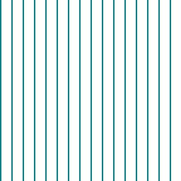

```c title="縦縞模様"
// 省略: 21.2.1 画像プログラミングの共通コード

int main()
{
	Image* image = CreateImage(256, 256);

	for (int y = 0; y < image->height; ++y)
	{
		for (int x = 0; x < image->width; ++x)
		{
			if ((x % 16) < 8)
			{
				SetPixel(image, x, y, (RGB){ 0.0, 0.5, 0.5 });
			}
			else
			{
				SetPixel(image, x, y, (RGB){ 1.0, 1.0, 1.0 });
			}
		}
	}

	Save("stripes1.bmp", image);
	DestroyImage(image);
}
```


### 2. 横縞模様

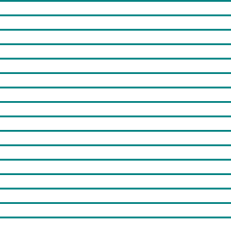

```c title="横縞模様"
// 省略: 21.2.1 画像プログラミングの共通コード

int main()
{
	Image* image = CreateImage(256, 256);

	for (int y = 0; y < image->height; ++y)
	{
		for (int x = 0; x < image->width; ++x)
		{
			if ((y % 16) < 8)
			{
				SetPixel(image, x, y, (RGB){ 0.0, 0.5, 0.5 });
			}
			else
			{
				SetPixel(image, x, y, (RGB){ 1.0, 1.0, 1.0 });
			}
		}
	}

	Save("stripes2.bmp", image);
	DestroyImage(image);
}
```


### 3. 格子模様

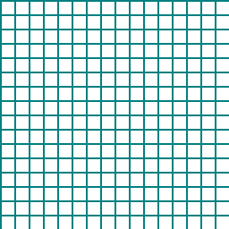

```c title="格子模様"
// 省略: 21.2.1 画像プログラミングの共通コード

int main()
{
	Image* image = CreateImage(256, 256);

	for (int y = 0; y < image->height; ++y)
	{
		for (int x = 0; x < image->width; ++x)
		{
			if (((x % 16) < 2) || ((y % 16) < 2))
			{
				SetPixel(image, x, y, (RGB){ 0.0, 0.5, 0.5 });
			}
			else
			{
				SetPixel(image, x, y, (RGB){ 1.0, 1.0, 1.0 });
			}
		}
	}

	Save("grid.bmp", image);
	DestroyImage(image);
}
```


### 4. 市松模様

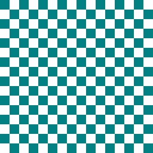

```c title="市松模様"
// 省略: 21.2.1 画像プログラミングの共通コード

int main()
{
	Image* image = CreateImage(256, 256);

	for (int y = 0; y < image->height; ++y)
	{
		for (int x = 0; x < image->width; ++x)
		{
			if (((x / 16) % 2) == ((y / 16) % 2))
			{
				SetPixel(image, x, y, (RGB){ 0.0, 0.5, 0.5 });
			}
			else
			{
				SetPixel(image, x, y, (RGB){ 1.0, 1.0, 1.0 });
			}
		}
	}

	Save("checker.bmp", image);
	DestroyImage(image);
}
```


### 5. 市松模様を円で切り抜き

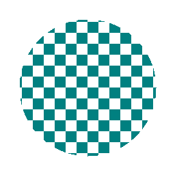

```c title="市松模様を円で切り抜き"
// 省略: 21.2.1 画像プログラミングの共通コード

int main()
{
	Image* image = CreateImage(256, 256);

	for (int y = 0; y < image->height; ++y)
	{
		for (int x = 0; x < image->width; ++x)
		{
			const int dx = x - 128;
			const int dy = y - 128;

			if ((dx * dx + dy * dy) <= (100 * 100)) // 円の内側
			{
				if (((x / 16) % 2) == ((y / 16) % 2))
				{
					SetPixel(image, x, y, (RGB){ 0.0, 0.5, 0.5 });
				}
				else
				{
					SetPixel(image, x, y, (RGB){ 1.0, 1.0, 1.0 });
				}
			}
			else // 円の外側
			{
				SetPixel(image, x, y, (RGB){ 1.0, 1.0, 1.0 });
			}
		}
	}

	Save("checker_circle.bmp", image);
	DestroyImage(image);
}
```


### 6. 水玉模様

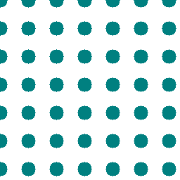

```c title="水玉模様"
// 省略: 21.2.1 画像プログラミングの共通コード

// 21.3.4 の円を描く関数
void DrawCircle(Image* image, int cx, int cy, int radius, RGB color)
{
	const int left = cx - radius;
	const int top = cy - radius;
	const int right = cx + radius;
	const int bottom = cy + radius;

	for (int y = top; y <= bottom; ++y)
	{
		for (int x = left; x <= right; ++x)
		{
			const int dx = x - cx;
			const int dy = y - cy;

			if ((dx * dx + dy * dy) <= (radius * radius))
			{
				SetPixel(image, x, y, color);
			}
		}
	}
}

int main()
{
	Image* image = CreateImage(256, 256);

	for (int y = 0; y < image->height; y += 40)
	{
		for (int x = 0; x < image->width; x += 40)
		{
			DrawCircle(image, x, y, 10, (RGB){ 0.0, 0.5, 0.5 });
		}
	}

	Save("polka_dots.bmp", image);
	DestroyImage(image);
}
```


### 7. 楕円

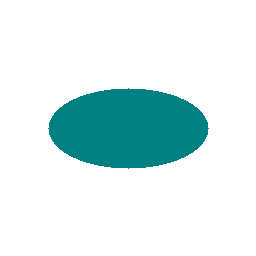

```c title="楕円"
// 省略: 21.2.1 画像プログラミングの共通コード

int main()
{
	Image* image = CreateImage(256, 256);

	// 楕円の中心座標
	double cx = 128;
	double cy = 128;

	// 楕円の X 軸と Y 軸の半径
	double rx = 80;
	double ry = 40;

	for (int y = 0; y < image->height; ++y)
	{
		for (int x = 0; x < image->width; ++x)
		{
			const double dx = x - cx;
			const double dy = y - cy;

			if (((dx * dx) / (rx * rx)) + ((dy * dy) / (ry * ry)) <= 1.0)
			{
				SetPixel(image, x, y, (RGB){ 0.0, 0.5, 0.5 });
			}
			else
			{
				SetPixel(image, x, y, (RGB){ 1.0, 1.0, 1.0 });
			}
		}
	}

	Save("ellipse.bmp", image);
	DestroyImage(image);
}
```


### 8. 輪郭がなめらかな円

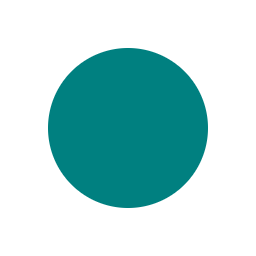

```c title="輪郭がなめらかな円"
#include <math.h>
// 省略: 21.2.1 画像プログラミングの共通コード

void DrawCircleSmooth(Image* image, int cx, int cy, double radius, RGB color)
{
	for (int y = (int)(cy - radius - 1); y <= (int)(cy + radius + 1); ++y)
	{
		for (int x = (int)(cx - radius - 1); x <= (int)(cx + radius + 1); ++x)
		{
			const double dx = (x + 0.5) - cx;
			const double dy = (y + 0.5) - cy;
			const double distance = sqrt(dx * dx + dy * dy);
			double a = radius + 0.5 - distance;

			if (a <= 0.0)
			{
				continue;
			}

			if (1.0 < a)
			{
				a = 1.0;
			}

			SetPixel(image, x, y, (RGB){
				1.0 + (color.r - 1.0) * a,
				1.0 + (color.g - 1.0) * a,
				1.0 + (color.b - 1.0) * a });
		}
	}
}

int main()
{
	Image* image = CreateImage(256, 256);

	DrawCircleSmooth(image, 128, 128, 80.0, (RGB){ 0.0, 0.5, 0.5 });

	Save("smooth_circle.bmp", image);
	DestroyImage(image);
}
```


### 9. ノイズ

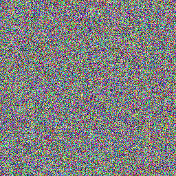

```c title="ノイズ"
#include <time.h>
// 省略: 21.2.1 画像プログラミングの共通コード

// [0.0, 1.0] の範囲の乱数を返す関数
double RandomDouble()
{
	return (double)rand() / RAND_MAX;
}

int main()
{
	Image* image = CreateImage(256, 256);
	srand((unsigned int)time(NULL));

	for (int y = 0; y < image->height; ++y)
	{
		for (int x = 0; x < image->width; ++x)
		{
			const double r = RandomDouble();
			const double g = RandomDouble();
			const double b = RandomDouble();
			SetPixel(image, x, y, (RGB){ r, g, b });
		}
	}

	Save("noise.bmp", image);
	DestroyImage(image);
}
```


### 10. レンガ模様

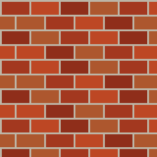

```c title="レンガ模様"
// 省略: 21.2.1 画像プログラミングの共通コード

// 21.3.2 の長方形を描く関数
void DrawRectangle(Image* image, int x, int y, int width, int height, RGB color)
{
	for (int y2 = y; y2 < (y + height); ++y2)
	{
		for (int x2 = x; x2 < (x + width); ++x2)
		{
			SetPixel(image, x2, y2, color);
		}
	}
}

int main()
{
	Image* image = CreateImage(256, 256);

	const int brickWidth = 48;
	const int brickHeight = 24;
	const int gap = 3;
	const RGB mortar = { 0.74, 0.71, 0.65 };

	// まず全体を目地の色で塗る
	DrawRectangle(image, 0, 0, image->width, image->height, mortar);

	for (int row = 0; row * brickHeight < image->height; ++row)
	{
		const int y = row * brickHeight;
		const int offset = (row % 2) * (brickWidth / 2);

		for (int x = -offset; x < image->width; x += brickWidth)
		{
			const int tone = (row * 3 + x / brickWidth * 5) % 4;

			// レンガの色を少しずつ変える（tone の値によって 4 種類の色を使い分ける）
			RGB brick = { 0.64, 0.22, 0.12 };

			if (tone == 1)
			{
				brick = (RGB){ 0.74, 0.28, 0.14 };
			}
			else if (tone == 2)
			{
				brick = (RGB){ 0.56, 0.18, 0.10 };
			}
			else if (tone == 3)
			{
				brick = (RGB){ 0.68, 0.34, 0.18 };
			}

			DrawRectangle(image, x + gap, y + gap, brickWidth - gap, brickHeight - gap, brick);
		}
	}

	Save("brick.bmp", image);
	DestroyImage(image);
}
```


### 11. 波紋

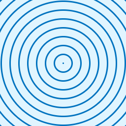

```c title="波紋"
#include <math.h>
// 省略: 21.2.1 画像プログラミングの共通コード

int main()
{
	Image* image = CreateImage(256, 256);

	const double cx = 128.0;
	const double cy = 128.0;
	const double interval = 18.0; // 輪と輪の間隔
	const double ringWidth = 3.0; // 輪の太さ
	const RGB background = { 0.88, 0.96, 1.0 };
	const RGB ring = { 0.0, 0.45, 0.75 };

	for (int y = 0; y < image->height; ++y)
	{
		for (int x = 0; x < image->width; ++x)
		{
			const double dx = x - cx;
			const double dy = y - cy;
			const double distance = sqrt(dx * dx + dy * dy);
			double d = fmod(distance, interval);

			if ((interval / 2.0) < d)
			{
				d = interval - d;
			}

			double a = (ringWidth / 2.0) + 0.5 - d;

			if (a < 0.0)
			{
				a = 0.0;
			}
			else if (1.0 < a)
			{
				a = 1.0;
			}

			SetPixel(image, x, y, (RGB){
				background.r + (ring.r - background.r) * a,
				background.g + (ring.g - background.g) * a,
				background.b + (ring.b - background.b) * a });
		}
	}

	Save("ripples.bmp", image);
	DestroyImage(image);
}
```
