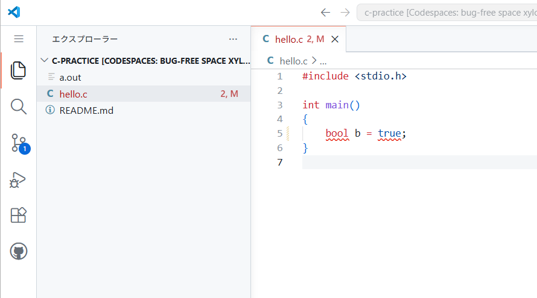

# 第 9 章 発展的な型

## 9.1

### 9.1.1

```c title="整数オーバーフローが起こる例"
#include <stdio.h>

int main()
{
	int a = 2147483647;
	printf("%d\n", a);
	printf("%d\n", (a + 1));

	int b = 10000;
	printf("%d\n", (b * b * b));
}
```

```c title="計算の途中での整数オーバーフローが起こる例"
#include <stdio.h>

int main()
{
	int a = 2000000000;
	int b = 2000000000;
	printf("%d\n", (a + b) / 2);
}
```

### 9.1.3

```c title="long long 型の出力"
#include <stdio.h>

int main()
{
	long long n = 123400000000LL;
	printf("%lld\n", n);
	printf("%lld\n", 999888877776666LL);
}
```

```c title="long long 型の出力（パディングあり）"
#include <stdio.h>

int main()
{
	printf("%5lld\n", 123LL); // フィールド幅 5, 右寄せ
	printf("%05lld\n", 123LL); // フィールド幅 5, ゼロパディングで右寄せ
}
```

### 9.1.4

```c title="long long 型の計算"
#include <stdio.h>

int main()
{
	long long a = 20000000000LL;
	long long b = 20000000000LL;
	printf("%lld\n", (a + b));

	long long c = 500000LL;
	printf("%lld\n", (c * c * c));

	c *= 10000LL;
	printf("%lld\n", c);

	printf("%d\n", (a == b));
}
```

### 9.1.5

```c title="long long 型の入力"
#include <stdio.h>

int main()
{
	long long n;
	scanf("%lld", &n);
	printf("%lld\n", (n * 2));

	long long a, b;
	scanf("%lld %lld", &a, &b);
	printf("%lld\n", (a + b));
}
```

### 9.1.6

```c title="int 型と long long 型が交ざる計算を行うコード"
#include <stdio.h>

int main()
{
	printf("%lld\n", (1LL + 2));
	printf("%lld\n", (100 * 20LL));

	int n = 300000;
	printf("%lld\n", (n * 300000LL));
}
```

### 9.1.7

```c title="❌ 誤り: int 型どうしの計算部分に注意が必要なコード"
#include <stdio.h>

int main()
{
	printf("%lld\n", (2000000000 + 2000000000) / 2LL);
}
```

```c title="⭕️ int 型どうしの計算を避けたコード"
#include <stdio.h>

int main()
{
	printf("%lld\n", (2000000000LL + 2000000000LL) / 2LL);
}
```

### 9.1.8

```c title="double 型と long long 型が交ざる計算を行うコード"
#include <stdio.h>

int main()
{
	printf("%f\n", (1LL + 1.5));
	printf("%f\n", (12.34 * 20LL));

	double n = 123.456;
	printf("%f\n", (n * 100LL));
}
```

### 9.1.9

```c title="long long 型から int 型への縮小変換"
#include <stdio.h>

int main()
{
	long long a = 2000000000LL; // 20 億
	int b = a; // 正常に変換される
	printf("%d\n", b);

	a = 3000000000LL; // 30 億
	b = a; // 処理系定義
	printf("%d\n", b);

	a = -3000000000LL; // -30 億
	b = a; // 処理系定義
	printf("%d\n", b);
}
```

### 9.1.10

```c title="long long 型から double 型への縮小変換"
#include <stdio.h>

int main()
{
	printf("%.1f\n", (double)123LL);

	printf("%.1f\n", (double)9007199254740992LL);

	// double 型で正確に表現できる整数範囲を超える整数
	printf("%.1f\n", (double)9007199254740993LL);

	// さらに大きな整数
	printf("%.1f\n", (double)9223372036854700000LL);
}
```

## 9.2

### 9.2.1

!!!warning "エディタ上で bool に赤い波線が表示される場合の対処方法"
	C 言語のコードで bool 型を使うと、次のようにエディタ上で赤い波線が表示されることがあります。これはエディタの設定が C23 ではなく C17 になっているためです。

	

	コンパイル自体は C23 で行うため、この赤い波線は無視しても構いませんが、気になる場合は「プログラムを動かす準備」の各手順にある「bool の赤波線を消す」を参考に、エディタの設定を変更することで、赤い波線を消すことができます。


```c title="bool 型を使う例（利用可能かどうか）"
#include <stdio.h>

int main()
{
	// サービスが利用可能かどうかを表す変数
	bool available = true;

	if (available)
	{
		puts("利用可能");
	}
	else
	{
		puts("利用不可");
	}
}
```

```c title="int 型を使う例（在庫数）"
#include <stdio.h>

int main()
{
	// 商品の在庫数を表す変数
	int available = 5;
	printf("在庫は %d 個あります。\n", available);
}
```

### 9.2.2

```c title="bool 型の出力"
#include <stdio.h>

int main()
{
	bool a = true;
	bool b = false;
	printf("%d\n", a);
	printf("%d\n", b);
}
```

```c title="bool 型の出力（文字列で出力）"
#include <stdio.h>

int main()
{
	bool a = true;
	bool b = false;
	puts(a ? "true" : "false");
	puts(b ? "true" : "false");
}
```

### 9.2.3

```c title="bool 型の変数への代入"
#include <stdio.h>

int main()
{
	bool available = true;

	if (available)
	{
		puts("利用可能");
	}
	else
	{
		puts("利用不可");
	}

	available = false;

	if (available)
	{
		puts("利用可能");
	}
	else
	{
		puts("利用不可");
	}
}
```

### 9.2.4

```c title="9.2.4　数値から bool 型への変換"
#include <stdio.h>

int main()
{
	bool a = 100;
	bool b = 0;
	bool c = -5;
	printf("%d\n", a);
	printf("%d\n", b);
	printf("%d\n", c);
	printf("%d\n", (bool)(a + b + c));
}
```

### 9.2.5

```c title="bool 型の変数と入力"
#include <stdio.h>

int main()
{
	int input;
	printf("免許を持っていますか？ (1: はい, 2: いいえ) > ");
	scanf("%d", &input);

	// 入力値を bool 型に変換する
	bool hasLicense = (input == 1); // input が 1 のとき true, それ以外は false

	if (hasLicense)
	{
		puts("運転できます。");
	}
	else
	{
		puts("運転免許を取得してください。");
	}
}
```

### 9.2.6

```c title="⚠️ 冗長な比較の例"
#include <stdio.h>

int main()
{
	bool available = true;

	if (available == true) // ❌️冗長
	{
		puts("利用可能");
	}
	else
	{
		puts("利用不可");
	}
}
```

```c title="⭕️ 推奨：冗長な比較を避ける例"
#include <stdio.h>

int main()
{
	bool available = true;

	if (available)
	{
		puts("利用可能");
	}
	else
	{
		puts("利用不可");
	}
}
```

```c title="⭕️ 推奨：論理否定演算子を使う例"
#include <stdio.h>

int main()
{
	bool available = false;

	if (!available)
	{
		puts("利用不可");
	}
	else
	{
		puts("利用可能");
	}
}
```

## 9.3

### 9.3.3

```c title="指数表記を使った浮動小数点数リテラルの例"
#include <stdio.h>

int main()
{
	double a = 1.23e4;
	double b = 5.67e-3;
	double c = 1e10;
	printf("a = %f\n", a);
	printf("b = %f\n", b);
	printf("c = %f\n", c);
}
```

## 9.4

### 9.4.2

```c title="size_t 型の使用例"
#include <stdio.h>

int main()
{
	size_t intSize = sizeof(int);
	printf("sizeof(int) = %zu バイト\n", intSize);
	printf("sizeof(double) = %zu バイト\n", sizeof(double));
	printf("sizeof(3.14 + 10) = %zu バイト\n", sizeof(3.14 + 10));
}
```

```c title="size_t を int にキャストして出力する例"
#include <stdio.h>

int main()
{
	int intSize = (int)sizeof(int);
	printf("sizeof(int) = %d バイト\n", intSize);
	printf("sizeof(double) = %d バイト\n", (int)sizeof(double));
	printf("sizeof(3.14 + 10) = %d バイト\n", (int)sizeof(3.14 + 10));
}
```

### 9.4.3

```c title="型のサイズを調べる例"
#include <stdio.h>

int main()
{
	printf("sizeof(char) = %zu バイト\n", sizeof(char));
	printf("sizeof(bool) = %zu バイト\n", sizeof(bool));
	printf("sizeof(int) = %zu バイト\n", sizeof(int));
	printf("sizeof(size_t) = %zu バイト\n", sizeof(size_t));
	printf("sizeof(long long) = %zu バイト\n", sizeof(long long));
	printf("sizeof(double) = %zu バイト\n", sizeof(double));
}
```

## 9.5

### 9.5.2

```c title="浮動小数点数型の例"
#include <stdio.h>

int main()
{
	float f = 3.14f;
	double d = 2.718281828459;
	long double ld = 1.414213562373095L;
	printf("%f\n", f);
	printf("%f\n", d);
	printf("%Lf\n", ld);
}
```

## 9.6

### 9.6.1

```c title="指数表記での出力の例"
#include <stdio.h>

int main()
{
	double a = 1.234e10;
	double b = 5.678e-10;
	printf("%f\n", a);
	printf("%f\n", b);
	printf("%e\n", a);
	printf("%e\n", b);
}
```

```c title="小数点以下の桁数指定"
#include <stdio.h>

int main()
{
	double a = 1.234e10;
	double b = 5.678e-10;
	printf("%.2e\n", a);
	printf("%.2e\n", b);
}
```
