# Codespaces で C 言語を始める

このページでは、**GitHub Codespaces（ギットハブ・コードスペース）**を使って C 言語のプログラムを書いて実行する方法を説明します。Codespaces を使うと、パソコンにコンパイラやエディタをインストールしなくても、Web ブラウザ上で Visual Studio Code に近い開発環境を使えます。

| デバイス | 対応状況 |
|--|:--:|
| Windows | ✅ |
| macOS | ✅ |
| Ubuntu | ✅ |
| iPad | ✅ |
| Chrome OS | ✅ |
| Android タブレット | ✅ |

使うものは次の 2 つです。

| ソフトウェア・サービス | 用途 |
|---|---|
| GitHub Codespaces | Web ブラウザ上で開発環境を動かす |
| GCC | C 言語のコードをコンパイルする |

## 1. Codespaces とは

Codespaces は、GitHub が提供するクラウド上の開発環境です。Web ブラウザから Visual Studio Code に近い画面を開き、ターミナルでコマンドを実行できます。

Codespaces では、作業用の Linux 環境がクラウド上に作成されます。この資料では、その Linux 環境の中で `gcc` を使って C 言語のプログラムをコンパイルします。

### 注意点

- GitHub アカウントが必要です
- Codespaces の利用には、時間や保存容量の制限があります

<!-- TODO: 「停止」と「削除」の UI 名称、無料枠の見え方、教育利用時の制限はアカウント種別で変わる可能性がある。 -->


## 2. GitHub にログインする

1. [GitHub :material-open-in-new:](https://github.com/){:target="_blank"} を開きます
2. GitHub アカウントでログインします

アカウントを持っていない場合は、GitHub の画面からアカウントを作成します。


## 3. 作業用リポジトリを作る

C 言語のファイルを保存するために、GitHub 上に作業用リポジトリを作ります。

1. GitHub 画面右上の **+** を押します
2. **New repository**（新しいリポジトリ）を選びます
3. **Repository name**（リポジトリ名）に `c-practice` と入力します（名前は任意）
4. **Choose visibility**（Web 上で公開するかどうか）は **Private**（非公開）を選びます
5. 緑色の **Create repository** ボタンを押します

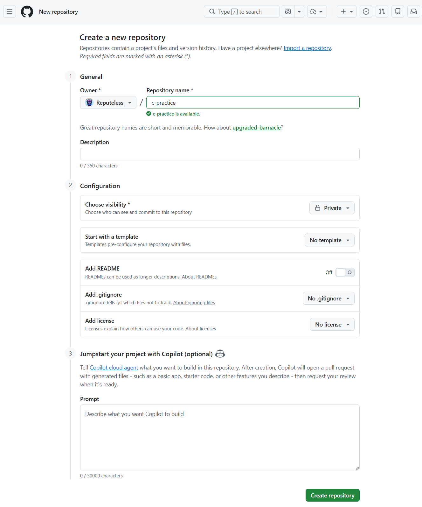

## 4. Codespace を作成する
次のようなスタート画面が表示されるので、**Start coding with Codespaces** 欄にある **Create a codespace** を押します。

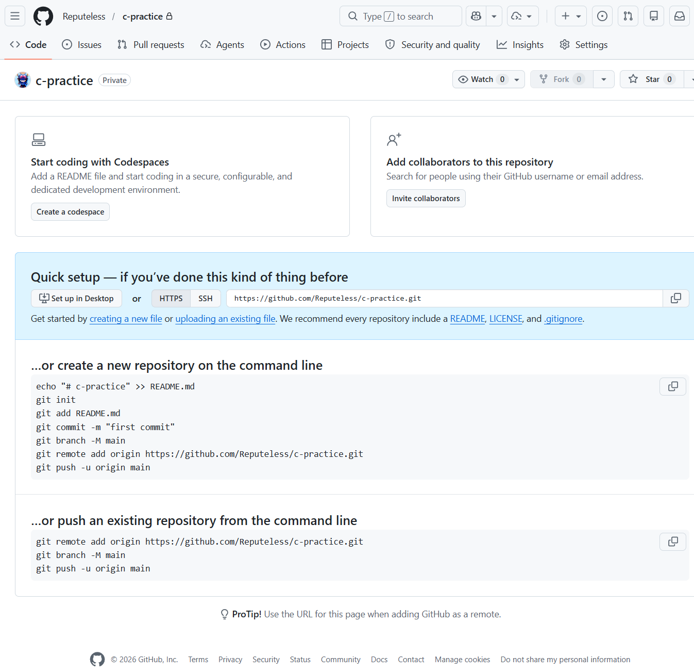

---

1. 緑色の **Create new codespace** ボタンを押します
2. Codespace の準備が終わるまで待ちます

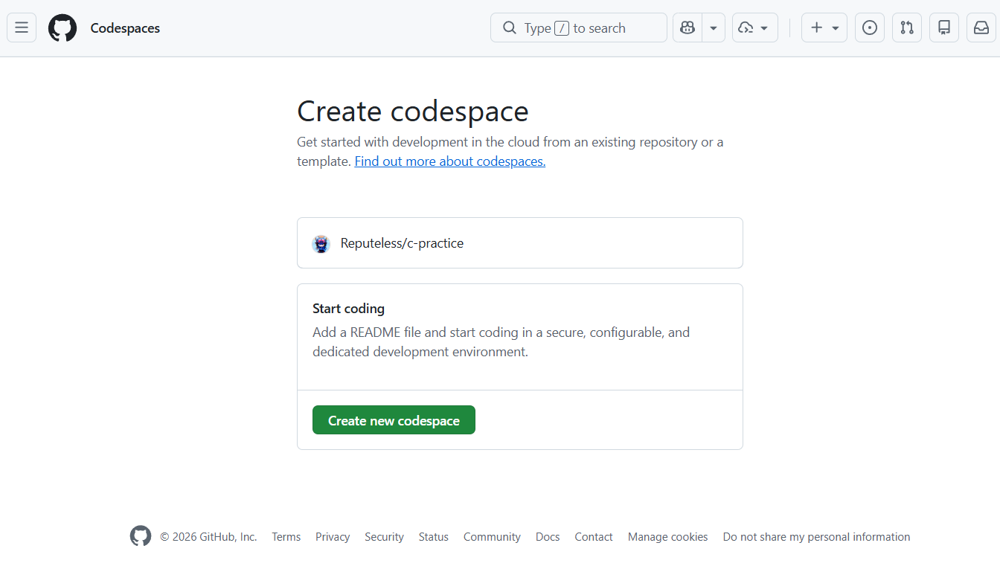

---

準備が終わると、Web ブラウザ上に Visual Studio Code に似た画面が表示されます。

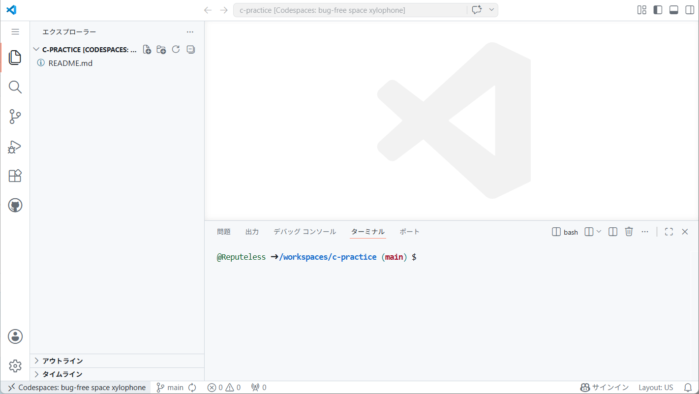


もし Codespaces の画面下にターミナルが表示されていない場合は、左側の :material-menu:（メニュー）から「表示」→「ターミナル」を選びます。


## 5. GCC が使えるか確認する

ターミナルでは、Linux のコマンドを実行できます。

標準の Codespaces 環境では、C 言語のコードをコンパイルするための `gcc`（ジーシーシー）というコマンドが使えます。

ターミナルで次のコマンドを実行します。

```sh title="GCC のバージョンを確認するコマンド"
gcc --version
```

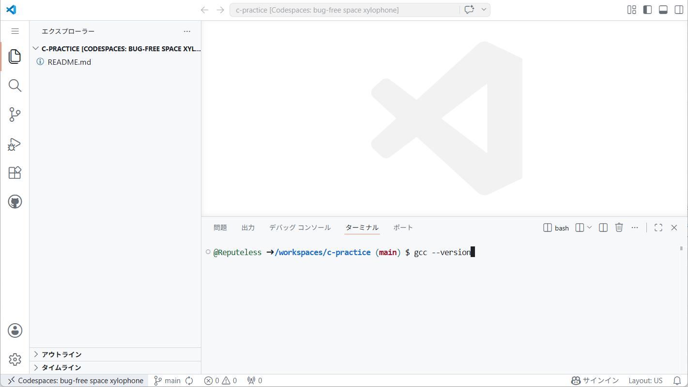


---

次のように、バージョン情報が表示されれば準備完了です。

```txt
gcc (Ubuntu 13.3.0-6ubuntu2~24.04.1) 13.3.0
```

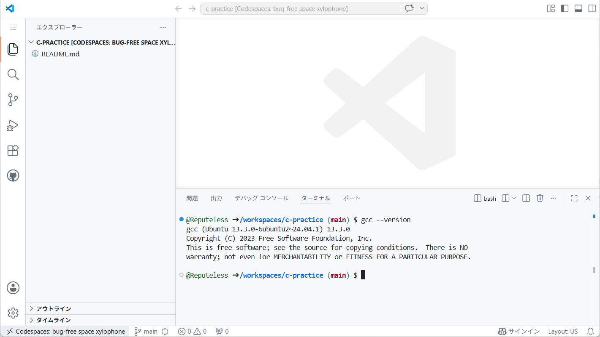

GCC 13 では、コンパイル時に `-std=c2x` を指定します。GCC 14 以降の場合は、`-std=c23` を指定できます。


## 6. C/C++ 拡張機能をインストールする

Visual Studio Code で C 言語のコードを扱いやすくするために、C/C++ 拡張機能をインストールします。

1. 左側の「拡張機能」アイコンをクリックします
2. 検索欄に `C/C++` と入力します  
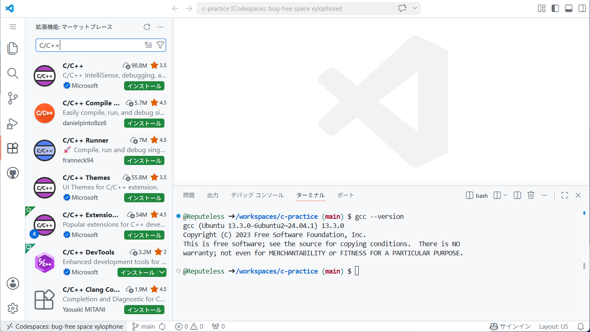
3. Microsoft の「**C/C++**」または「**C/C++ Extension Pack**」を選択します（どちらを選んでも構いません。後者はいくつか追加の拡張機能が含まれています）
4. 「インストール」を押します  
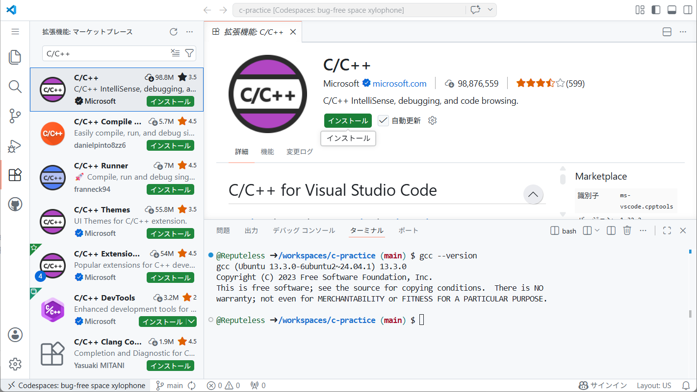


## 7. 最初の C プログラムを書く

画面左側のエクスプローラーで、`hello.c` という名前のファイルを作成します。

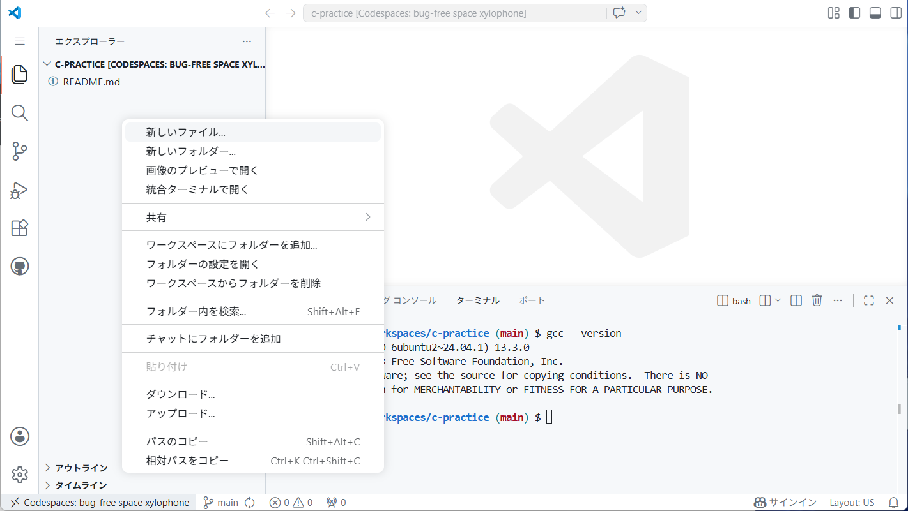

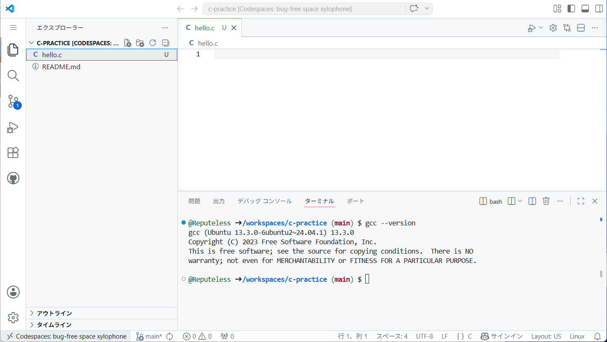

---

`hello.c` に、次のコードを書いてみましょう。

```c title="hello.c"
#include <stdio.h>

int main()
{
	puts("Apple");
	puts("Banana");
}
```

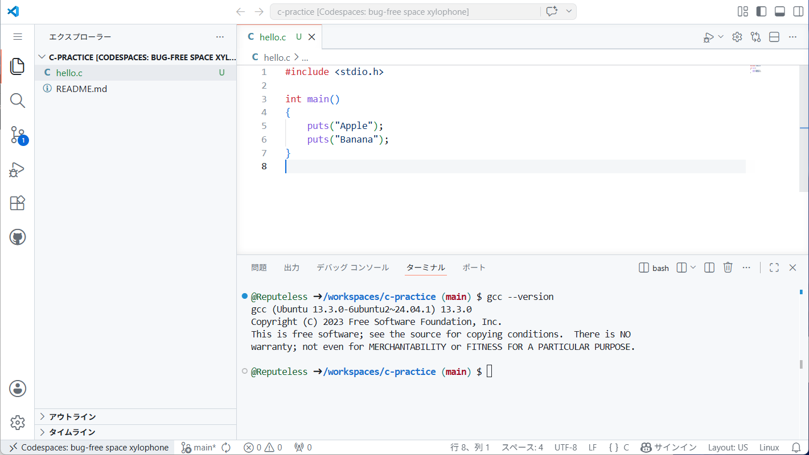

このコードが、画面に `Apple` と `Banana` を表示するプログラムになります。


## 8. コンパイルして実行する

ターミナルで次のコマンドを入力して、プログラムをコンパイルします。

```sh title="GCC 13 で hello.c をコンパイルするコマンド"
gcc -std=c2x hello.c
```

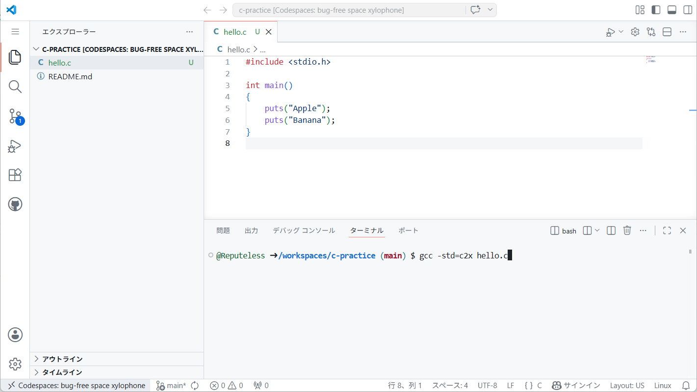

---

コンパイルに成功すると、`a.out` という実行ファイルが作られます。エクスプローラー上でも `a.out` を確認できます。

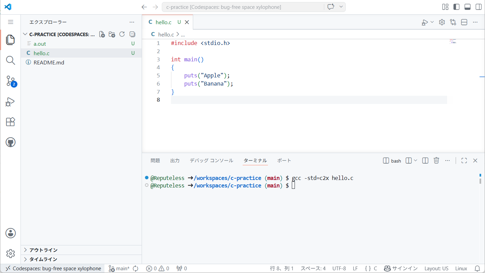

---

次のコマンドで実行します。

```sh title="hello.c をコンパイルしてできた実行ファイル a.out を実行するコマンド"
./a.out
```

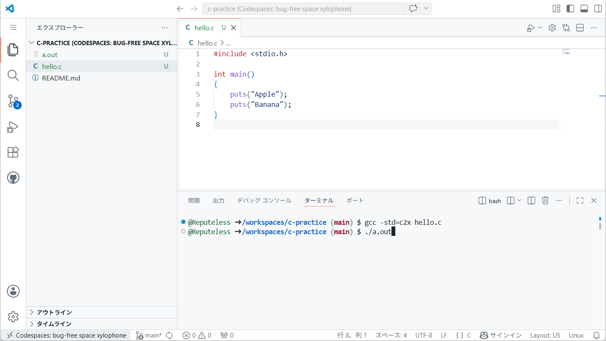

---

ターミナル内に次のように表示されれば成功です。

```txt title="出力"
Apple
Banana
```

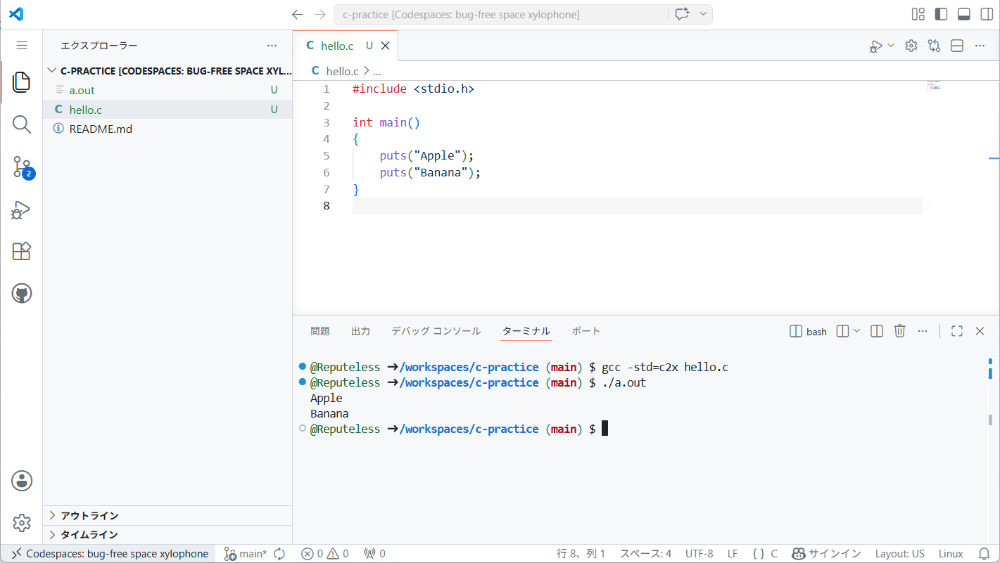


## 9. 入力を扱うプログラムを実行する

次のプログラムは、商品の価格と支払金額を入力し、おつりを計算します。

`hello.c` の内容を次のコードに書き換えて保存します。

```c title="hello.c"
#include <stdio.h>

int main()
{
	printf("商品の価格（円）を入力してください >\n");
	int price;
	scanf("%d", &price);

	printf("支払った金額（円）を入力してください >\n");
	int payment;
	scanf("%d", &payment);

	int change = payment - price;

	if (change < 0)
	{
		puts("支払金額が不足しています");
	}
	else
	{
		printf("おつり: %d 円\n", change);
	}
}
```

コンパイルします。

```sh title="GCC 13 で hello.c をコンパイルするコマンド"
gcc -std=c2x hello.c
```

実行します。

```sh title="hello.c をコンパイルしてできた実行ファイル a.out を実行するコマンド"
./a.out
```

実行中に入力を求められたら、数字を入力して Enter キーを押します。

```txt title="入力例"
商品の価格（円）を入力してください >
880
支払った金額（円）を入力してください >
1000
おつり: 120 円
```

Codespaces のターミナルでは、実行中のプログラムに対してキーボードから直接入力できます。


## 10. 書いたコードを保存する

Codespaces 内で作成したファイルは、Codespace の中に保存されます。GitHub のリポジトリにも保存したい場合は、変更をコミットします。

1. 左側の「ソース管理」アイコンをクリックします
2. メッセージ欄に `Add hello.c` のような、変更内容を説明するメッセージを入力します
3. **コミット** を押します
4. **変更の同期** を押します

コミットとプッシュが完了すると、GitHub のリポジトリページにも `hello.c` が表示されます。


## 11. Codespace を停止する・作業を再開する

無料枠を使い切って、制限がかからないようにするために、使い終わった Codespace は停止しておくことをおすすめします。

[https://github.com/codespaces :material-open-in-new:](https://github.com/codespaces){:target="_blank"} から Codespace を停止できます。

---

停止した Codespace は、同じページから再開できます。再開すると、前回の続きから作業を始められます。


## 12. よくあるトラブルと対処

!!! question "Codespaces が表示されない"

	GitHub にログインしているか確認してください。

	リポジトリやアカウントの設定によって、Codespaces が使えない場合があります。

	<!-- TODO: 個人アカウント、Organization、教育機関アカウントで Codespaces の有効/無効や課金設定が異なる。 -->

!!! question "Codespace の作成に時間がかかる"

	Codespace の初回作成には時間がかかることがあります。

	しばらく待っても進まない場合は、ページを再読み込みするか、Codespaces の一覧から作り直します。

!!! question "`gcc: command not found` と表示される"

	```txt title="エラーメッセージ"
	gcc: command not found
	```

	GCC がインストールされていない可能性があります。

	次のコマンドを実行します。

	```sh
	sudo apt update
	sudo apt install build-essential
	```

!!! question "`hello.c: No such file or directory` と表示される"

	```txt title="エラーメッセージ"
	cc1: fatal error: hello.c: No such file or directory
	compilation terminated.
	```

	ターミナルで開いているフォルダに `hello.c` がありません。

	エクスプローラーで `hello.c` を作成したフォルダを開いているか確認してください。

!!! question "`a.out: command not found` と表示される"

	```txt title="エラーメッセージ"
	a.out: command not found
	```

	実行するときは、ファイル名の前に `./` を付けます。

	```sh title="誤った実行方法"
	a.out
	```

	```sh title="正しい実行方法"
	./a.out
	```
