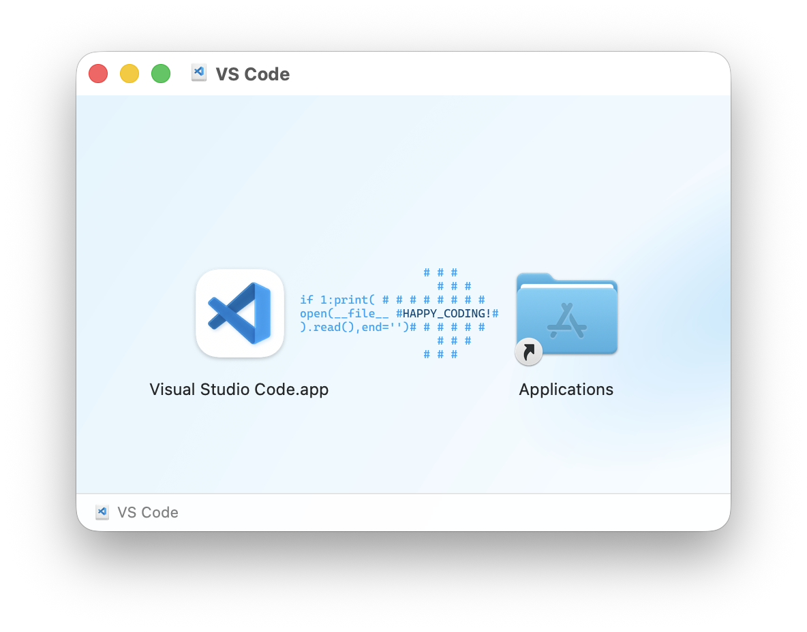
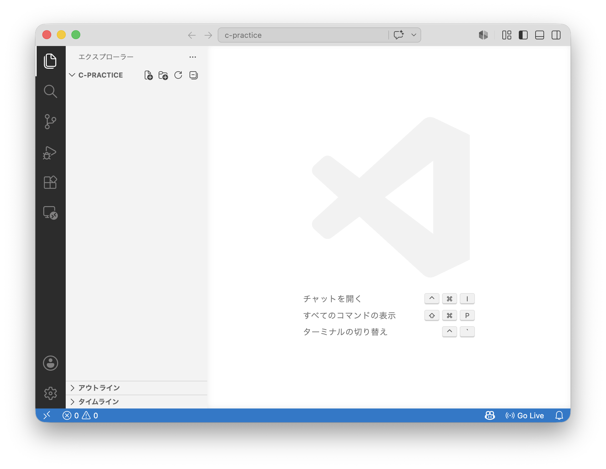
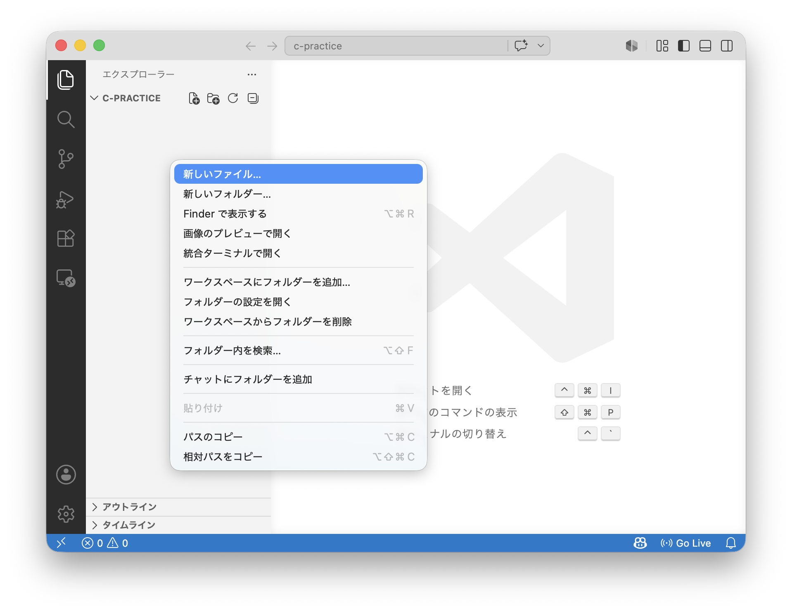
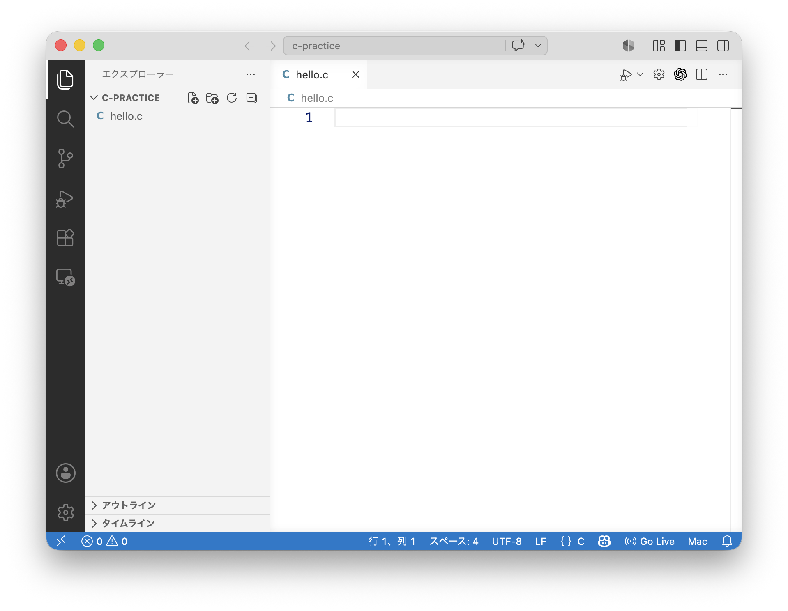
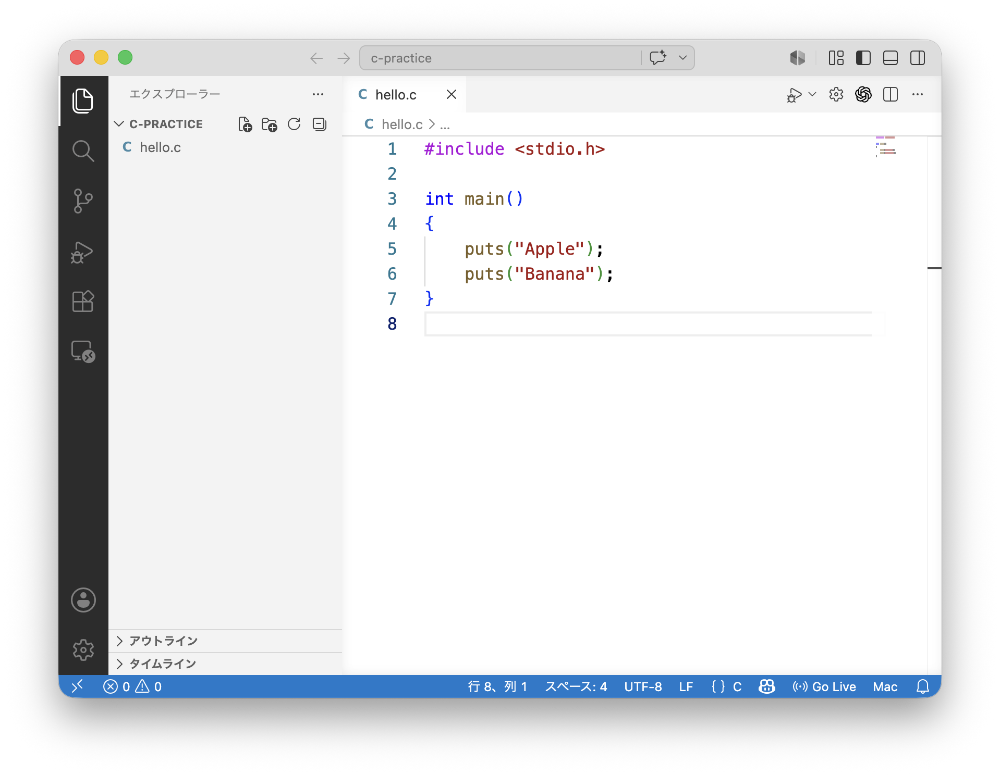
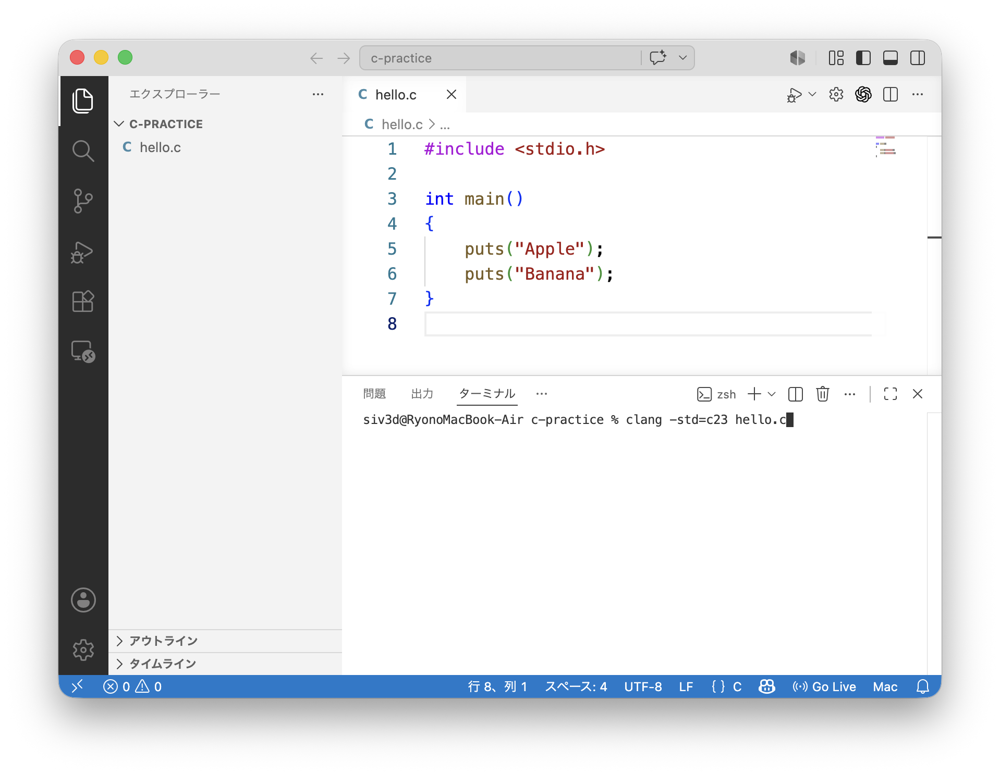
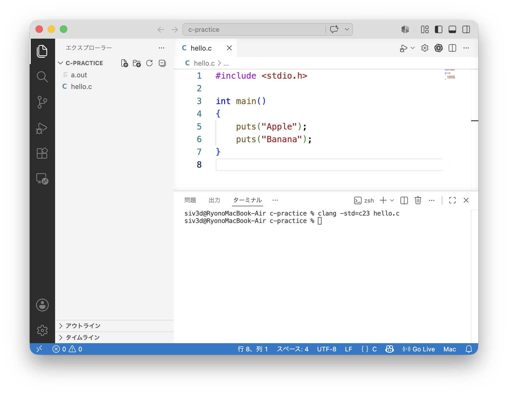
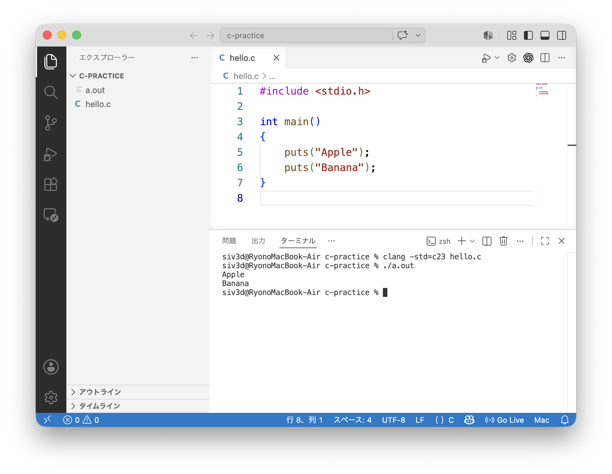

# macOS で C 言語を始める

このページでは、**macOS** に C 言語の開発環境を用意し、Visual Studio Code で C 言語のプログラムを書いて実行する方法を説明します。

| デバイス | 対応状況 |
|--|:--:|
| Windows |  |
| macOS | ✅ |
| Ubuntu |  |
| iPad |  |
| Chrome OS |  |
| Android タブレット |  |

使うものは次の 2 つです。

| ソフトウェア | 用途 |
|---|---|
| Command Line Tools for Xcode | C 言語のコードをコンパイルする |
| Visual Studio Code | C 言語のコードを書くエディタ |

## 1. Command Line Tools for Xcode をインストールする

macOS では、Command Line Tools for Xcode をインストールすると、C 言語のコードをコンパイルするための `clang`（クラン）というコマンドが使えるようになります。

まず、ターミナルを開きます。

1. Finder で「アプリケーション」を開きます
2. 「ユーティリティ」を開きます
3. 「ターミナル」を起動します

ターミナルで次のコマンドを入力し、Enter キーを押します。

```sh
xcode-select --install
```

確認画面が表示されたら、画面の指示に従ってインストールします。

すでにインストール済みの場合は、その旨のメッセージが表示されます。その場合は次に進んでかまいません。


## 2. clang が使えるか確認する

ターミナルで次のコマンドを実行します。

```sh
clang --version
```

次のように、バージョン情報が表示されれば準備完了です。

```txt
Apple clang version ...
```

## 3. Visual Studio Code をインストールする

1. [Visual Studio Code :material-open-in-new:](https://code.visualstudio.com/){:target="_blank"} の公式サイトを開きます
2. macOS 版の `.dmg` ファイルをダウンロードします
3. ダウンロードした `.dmg` ファイルを開きます
4. 表示された Visual Studio Code を「Applications（アプリケーション）」フォルダにドラッグすることで、インストールします  

5. Visual Studio Code を起動します

## 4. Visual Studio Code を日本語化する

Visual Studio Code は、インストール直後は英語のインターフェースになっています。次の手順で日本語化できます。

1. Visual Studio Code 左側の **Extensions** アイコン :material-view-grid-outline: をクリックします
2. 検索欄に `Japanese Language Pack` と入力します
3. Microsoft の **Japanese Language Pack for Visual Studio Code** を選択します
4. **Install** を押します
5. 再起動を促すメッセージが表示されたら、Visual Studio Code を再起動します

## 5. C/C++ 拡張機能をインストールする

Visual Studio Code で C 言語のコードを扱いやすくするために、C/C++ 拡張機能をインストールします。

1. Visual Studio Code 左側の「拡張機能」アイコン :material-view-grid-outline: をクリックします
2. 検索欄に `C/C++` と入力します
3. Microsoft の **C/C++** を選択します
4. 「インストール」を押します


## 6. 作業用フォルダを作る

C 言語のファイルを保存するためのフォルダを作ります。

例えば、Finder で次のようなフォルダを作ります。

```txt
Documents
└── c-practice
```

Visual Studio Code で、この `c-practice` フォルダを開きます。

1. Visual Studio Code を開きます
2. 「ファイル」→「フォルダーを開く...」を選びます
3. 作成した `c-practice` フォルダを選びます




## 7. 最初の C プログラムを書く

`c-practice` フォルダの中に、`hello.c` という名前のファイルを作成します。





---

`hello.c` に、次のコードを書いて保存します。

```c title="hello.c"
#include <stdio.h>

int main()
{
	puts("Apple");
	puts("Banana");
}
```



このコードが、画面に `Apple` と `Banana` を表示するプログラムになります。


## 8. コンパイルして実行する

Visual Studio Code のメニューから「表示」→「ターミナル」を選びます。

画面下にターミナルが表示されます。


---

次のコマンドを入力して、プログラムをコンパイルします。

```sh
clang -std=c23 hello.c
```



---

コンパイルに成功すると、`a.out` という実行ファイルが作られます。エクスプローラー上でも `a.out` を確認できます。



---

次のコマンドで実行します。

```sh
./a.out
```




ターミナル内に次のように表示されれば成功です。

```txt title="出力"
Apple
Banana
```

## 9. 入力を扱うプログラムを実行する

次のプログラムは、商品の価格と支払金額を入力し、おつりを計算します。

`hello.c` の内容を次のコードに書き換えて保存します。

```c title="hello.c"
#include <stdio.h>

int main()
{
	printf("商品の価格（円）を入力してください >\n");
	int price;
	scanf("%d", &price);

	printf("支払った金額（円）を入力してください >\n");
	int payment;
	scanf("%d", &payment);

	int change = payment - price;

	if (change < 0)
	{
		puts("支払金額が不足しています");
	}
	else
	{
		printf("おつり: %d 円\n", change);
	}
}
```

コンパイルします。

```sh
clang -std=c23 hello.c
```

実行します。

```sh
./a.out
```

実行中に入力を求められたら、数字を入力して Enter キーを押します。

```txt title="入力例"
商品の価格（円）を入力してください >
880
支払った金額（円）を入力してください >
1000
おつり: 120 円
```


macOS のターミナルでは、実行中のプログラムに対してキーボードから直接入力できます。

## 10. おすすめコンパイルコマンド

コンパイラ・オプションの意味は [**付録 3. コンパイラ・オプション**](../appendix/compiler-options.md) を参照してください。

```txt title="コンパイルコマンド"
clang -Wall -Wextra -Wvla -Wstrict-prototypes -Wconversion -Wshadow -pedantic -std=c23 hello.c -lm
```


## 11. よくあるトラブルと対処

??? question "`clang: command not found` と表示される"

	```txt title="エラーメッセージ"
	zsh: command not found: clang
	```

	Command Line Tools for Xcode がインストールされていない可能性があります。

	次のコマンドを実行します。

	```sh
	xcode-select --install
	```

??? question "`no such file or directory: 'hello.c'` と表示される"

	```txt title="エラーメッセージ"
	clang: error: no such file or directory: 'hello.c'
	```

	ターミナルで開いているフォルダに `hello.c` がありません。

	Visual Studio Code で `hello.c` を保存したフォルダを開いているか確認してください。

??? question "`Permission denied` と表示される"

	```txt title="エラーメッセージ"
	zsh: permission denied: a.out
	```

	実行するときは、ファイル名の前に `./` を付けます。

	```sh title="誤った実行方法"
	a.out
	```

	```sh title="正しい実行方法"
	./a.out
	```

??? question "`invalid value 'c23' in '-std=c23'` と表示される"

	```txt title="エラーメッセージ"
	error: invalid value 'c23' in '-std=c23'
	```

	使用している `clang` が `-std=c23` に対応していない可能性があります。

	次のコマンドでバージョンを確認します。

	```sh
	clang --version
	```

	macOS または Command Line Tools for Xcode をアップデートしてください。
