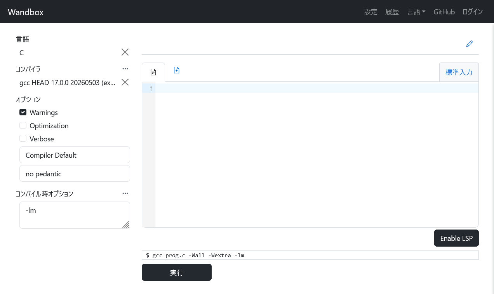
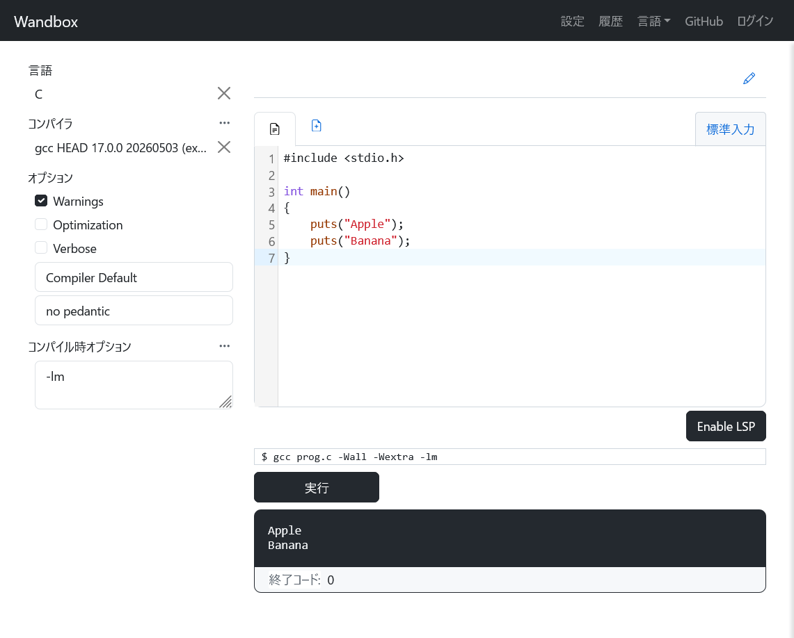
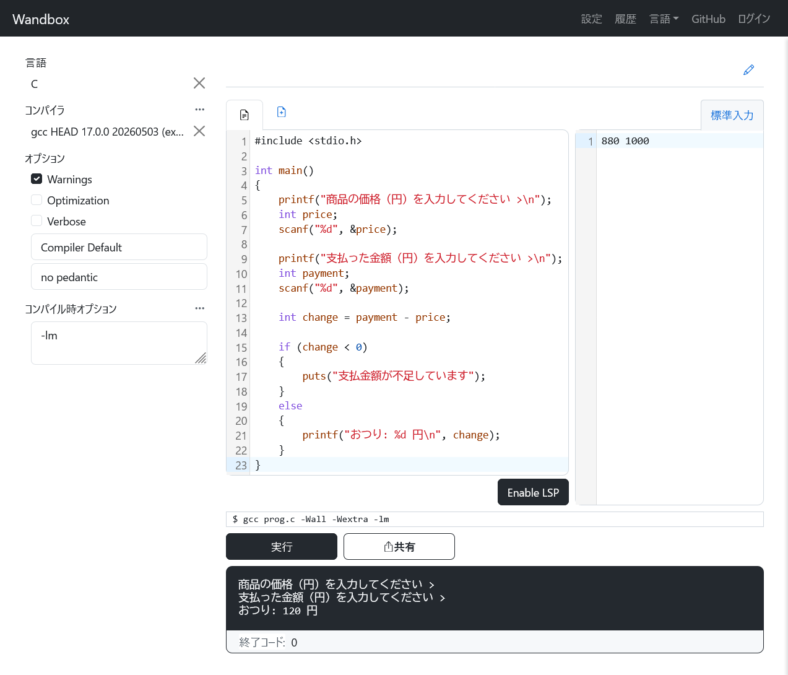

# Wandbox で C 言語を始める

このページでは、**Wandbox（ワンドボックス）**を使って C 言語のプログラムを実行する方法を説明します。Wandbox を使うと、パソコンやタブレットに開発環境をインストールせずに、Web ブラウザだけで C 言語のコードを試せます。

| デバイス | 対応状況 |
|--|:--:|
| Windows | ✅ |
| macOS | ✅ |
| Ubuntu | ✅ |
| iPad | ✅ |
| Chrome OS | ✅ |
| Android タブレット | ✅ |

## 1. Wandbox とは
- は、ユーザ登録なしで使えるオンラインコンパイラです
- C 言語を含むさまざまなプログラミング言語で、コードのコンパイルと実行結果の確認ができます
- パソコンやタブレットに何もインストールせずに、手軽に C 言語のプログラムを試したいときに便利です

### 長所
- Web ページにアクセスするだけで、C コードを書いて実行結果を確認できます
- **コードの共有機能**が使えます。URL をシェアすると、他の人に自分のコードを見てもらうことができます
- 入力欄と出力欄が分離されているため、プログラムとユーザが交互に入出力をおこなうプログラムを実行した際に、どれがプログラムによる出力であるかを確認しやすいです

### 短所
- プログラムに入力したい内容がある場合、あらかじめ「標準入力」欄に記述しておく必要があります。実行中のプログラムに対話的にデータ入力を行うことはできません
- ボランティアで運営されているサービスのため、アクセスが集中した際などに、コンパイルや実行に時間がかかることがあります

## 2. 使い方 ①

### Wandbox を開く
1. [https://wandbox.org/ :material-open-in-new:](https://wandbox.org/) にアクセスします

### 設定を選ぶ
1. **言語**で「C」を選択します
1. **コンパイラ**で「gcc 15」より新しいバージョンを選択します  
（下記の例では `gcc HEAD 17.0.0`）
1. **オプション**に「C11(GNU)」がある場合、「Compiler Default」に変更します
1. **コンパイル時オプション**欄は、最初は空欄のままでかまいません。  
第 10 章以降で数学関数を使う場合だけ `-lm` を入力します。



### コードを書いて実行する
1. 画面の中央がエディタです。ここに C 言語のコードを書いていきます
1. エディタ上にコードを書いたら「実行」を押すとコンパイルが始まります
1. コンパイルが成功したら、そのプログラムが実行され、出力が表示されます



```c title="画像内のサンプルコード"
#include <stdio.h>

int main()
{
	puts("Apple");
	puts("Banana");
}
```


## 3. 使い方 ②
- 第 3 章以降に出てくる `scanf()` のように、標準入力からの入力を扱うプログラムを実行する場合、あらかじめ右側の「標準入力」欄に入力内容を記述します
- 入力内容が複数ある場合、半角空白や改行で区切ります



```c title="画像内のサンプルコード"
#include <stdio.h>

int main()
{
	printf("商品の価格（円）を入力してください >\n");
	int price;
	scanf("%d", &price);

	printf("支払った金額（円）を入力してください >\n");
	int payment;
	scanf("%d", &payment);

	int change = payment - price;

	if (change < 0)
	{
		puts("支払金額が不足しています");
	}
	else
	{
		printf("おつり: %d 円\n", change);
	}
}
```
```txt title="標準入力欄の記入例"
880 1000
```


## 4. 書いたソースコードを他人と共有する
- 実行後に「:material-upload:共有」を押すと、書いた内容を URL で共有できます
	- URL の例: [https://wandbox.org/permlink/S8zs9kYzMAajKFUx](https://wandbox.org/permlink/S8zs9kYzMAajKFUx){:target="_blank"}
- URL は Web ブラウザの URL 欄からコピーします


## 5. Wandbox のよくあるトラブルとその対処

!!! question "正しいコードなのにエラーになる"
	- [エラーの例 :material-open-in-new:](https://wandbox.org/permlink/T6uhQj4LAGd29o0N){:target="_blank"}

	```txt title="エラーメッセージ"
	/usr/bin/ld: cannot find -lm : No such file or directory
	collect2: error: ld returned 1 exit status
	```

	- 原因: Wandbox の「コンパイル時オプション」の欄に、不必要な空白文字が入っています。それがファイル名と解釈され、空白文字のファイルをコンパイルしようとしてエラーになっています
	- 解決法: 「コンパイル時オプション」の欄を空にします


!!! question "数学関数を使うとエラーになる"
	- [エラーの例 :material-open-in-new:](https://wandbox.org/permlink/mDiQJjcXtJIqoZcV){:target="_blank"}

	```txt title="エラーメッセージ"
	/usr/bin/ld: /tmp/ccUIxmmj.o: in function `main':
	prog.c:(.text+0x28): undefined reference to `sqrt'
	collect2: error: ld returned 1 exit status
	```

	- 原因: 数学関数を使うためのライブラリがリンクされていません（**第 10 章** 参照）
	- 解決法: Wandbox の[「コンパイル時オプション」欄に `-lm` を追加します。:material-open-in-new:](https://wandbox.org/permlink/nNIIRLZYUYjZg5dW){:target="_blank"}
