# Windows で C 言語を始める

このページでは、**Windows** に WSL2 と Ubuntu を用意し、Visual Studio Code で C 言語のプログラムを書いて実行する方法を説明します。

WSL2（Windows Subsystem for Linux 2）を使うと、Windows の中で Ubuntu（ウブンツ）を動かせます。この資料では、C 言語のコンパイルと実行は WSL2 上の Ubuntu で行います。

| デバイス | 対応状況 |
|--|:--:|
| Windows | ✅ |
| macOS |  |
| Ubuntu |  |
| iPad |  |
| Chrome OS |  |
| Android タブレット |  |

使うものは次の 3 つです。

| ソフトウェア | 用途 |
|---|---|
| WSL2 / Ubuntu | Windows 上で Ubuntu を動かす |
| GCC | C 言語のコードをコンパイルする |
| Visual Studio Code | C 言語のコードを書くエディタ |

## 1. WSL2 と Ubuntu をインストールする

この手順は、Windows 11 または Windows 10 バージョン 2004 以降を想定しています。

まず、PowerShell を管理者として開きます。

1. スタートメニューを開きます
2. `PowerShell` と入力します
3. **Windows PowerShell** または **ターミナル** を右クリックします
4. 「管理者として実行」を選びます  
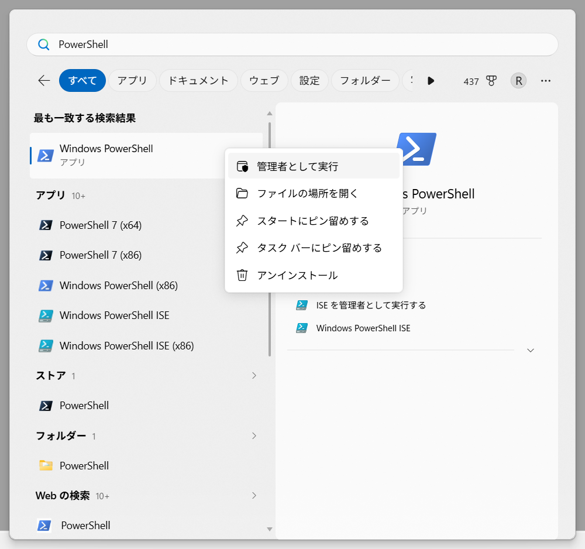

---

PowerShell で次のコマンドを実行します。

```powershell title="WSL と Ubuntu をインストールするコマンド"
wsl --install
```

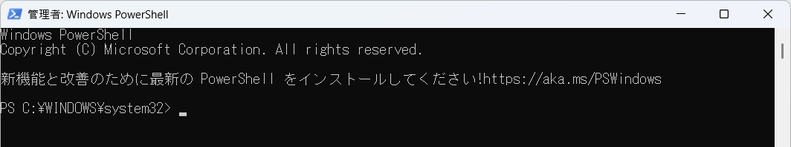

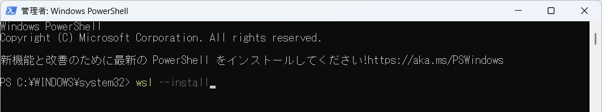

---

WSL と Ubuntu のインストールが始まります。完了するまで、しばらく時間がかかることがあります。

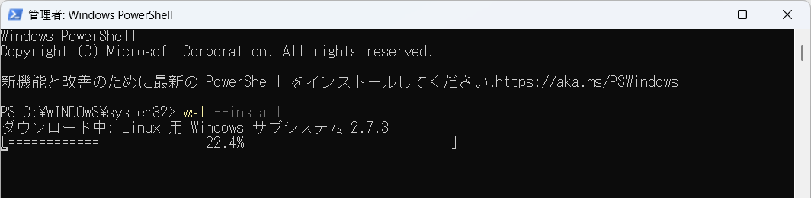

---

インストールが完了すると、次のようなメッセージが表示され、Ubuntu の初期設定が始まります。

```txt
Ubuntu を起動しています...
Provisioning the new WSL instanance Ubuntu
This might take a while...
Create a default UNIX user account: （ユーザー名）
```

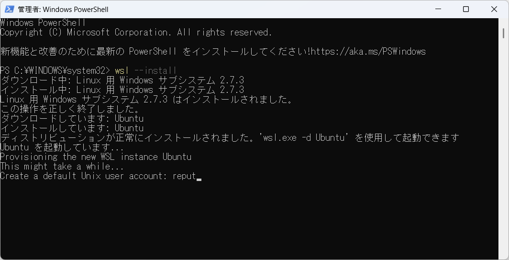

表示されているユーザ名でよければ ++enter++ キーを押します。

---

Ubuntu のパスワードを設定します。

!!!info "パスワード入力について"
	Ubuntu のターミナルでは、パスワードを入力しても画面には文字が表示されません。何も入力されていないように見えても、実際には入力されています。入力後、++enter++ キーを押します。

間違い防止のため、`Retype new password:` と、2 回目の入力も求められます。もう一度同じパスワードを入力して ++enter++ キーを押します。

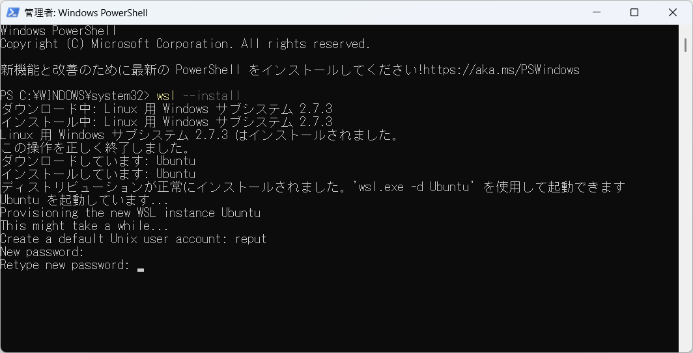

---

製品改善のための使用状況の収集に関する質問が表示されたら、好みに応じて選択します。++n++（いいえ）を選んで問題ありません。

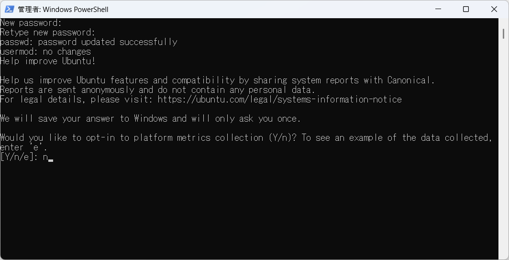

---

とくに指示などが表示されなくなれば、WSL2 と Ubuntu のインストールは完了です。一旦 PowerShell を閉じましょう。

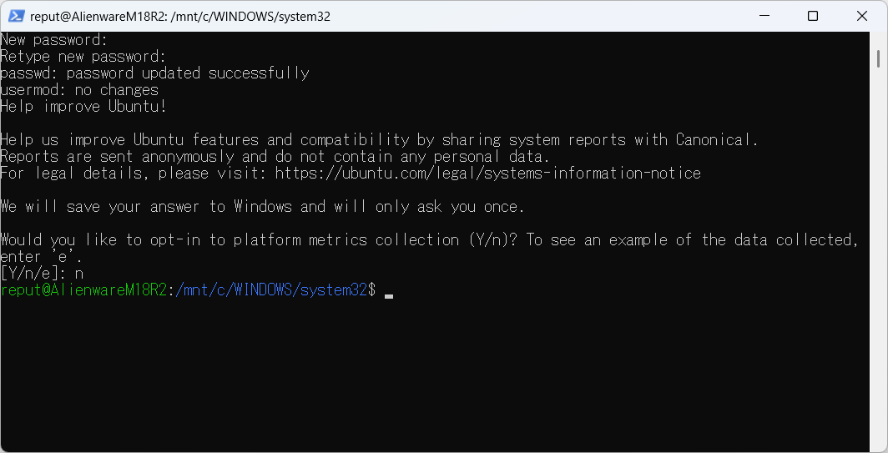


## 2. インストールできたか確認する

ふたたび PowerShell またはターミナルを開きます。今度は管理者として開く必要はありません。

次のコマンドを実行します。

```powershell title="WSL のバージョンを確認するコマンド"
wsl -l -v
```

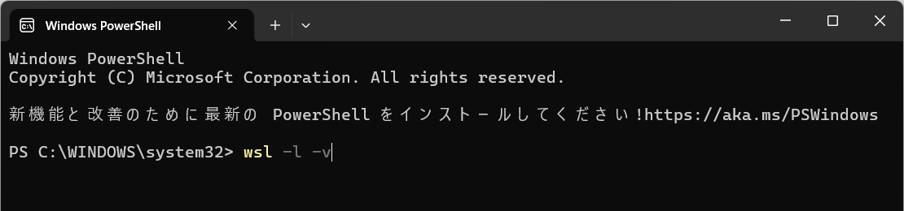

---

次のように、Ubuntu の `VERSION` が `2` になっていれば準備できています。

```txt title="WSL のバージョン確認の出力例"
  NAME      STATE           VERSION
* Ubuntu    Running         2
```

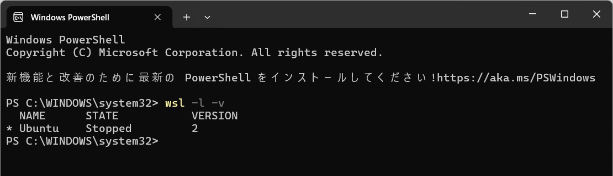

確認できたら、PowerShell を閉じます。


## 3. Ubuntu を起動する

Windows のスタートメニューから **Ubuntu** を起動します。

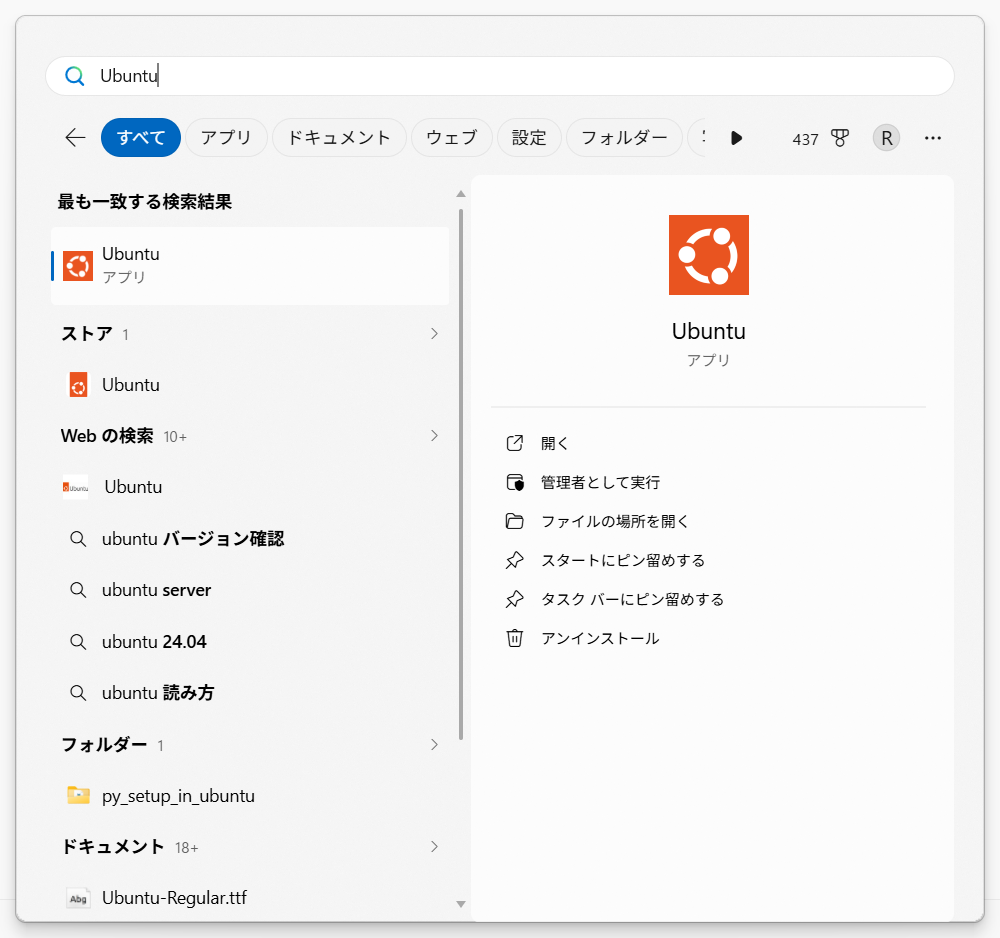

---

起動すると、次のような Ubuntu のターミナルが表示されます。

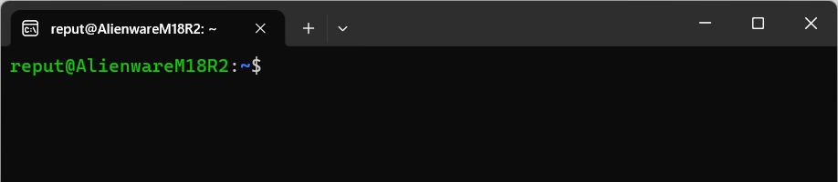


## 4. GCC をインストールする

C 言語のコンパイラ GCC を使えるようにするために、`build-essential` というパッケージをインストールします。

Ubuntu のターミナルで次のコマンドを順に実行します。

```sh title="パッケージ一覧を最新化するコマンド"
sudo apt update
```

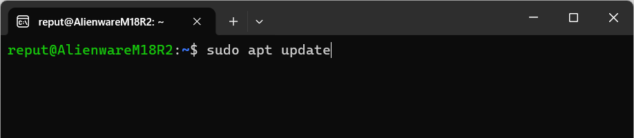

パスワードの入力を求められたら、先ほど設定したパスワードを入力して ++enter++ キーを押します。

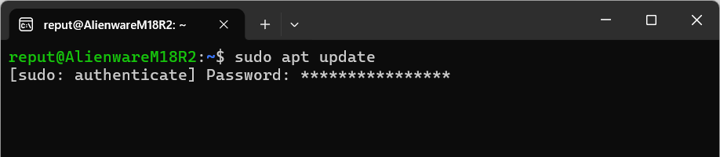

パッケージ情報の更新作業が始まります。完了するまで、しばらく時間がかかることがあります。

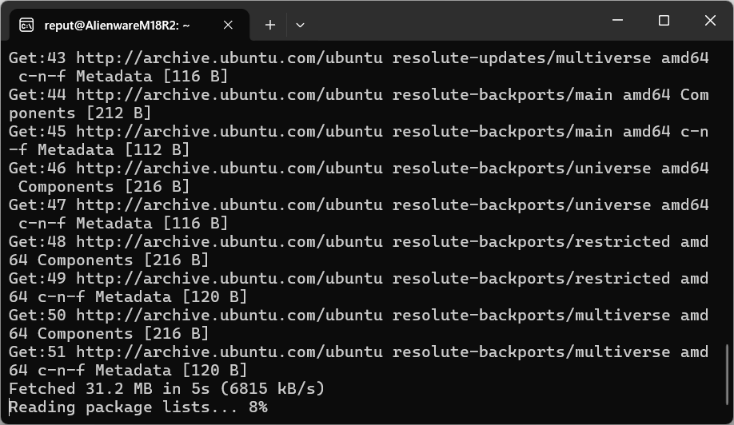

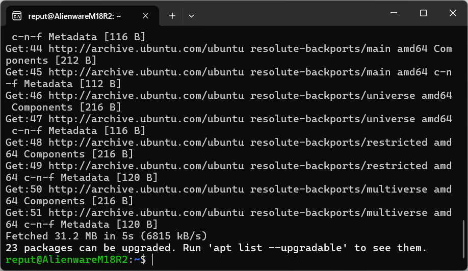

---

終わったら、次のコマンドを実行して、`build-essential` をインストールします。

```sh title="C 言語での開発に必要な基本ツール一式をインストールするコマンド"
sudo apt install build-essential
```

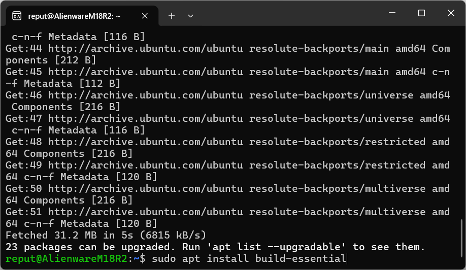

途中で確認を求められたら、++y++ を入力して ++enter++ キーを押します。

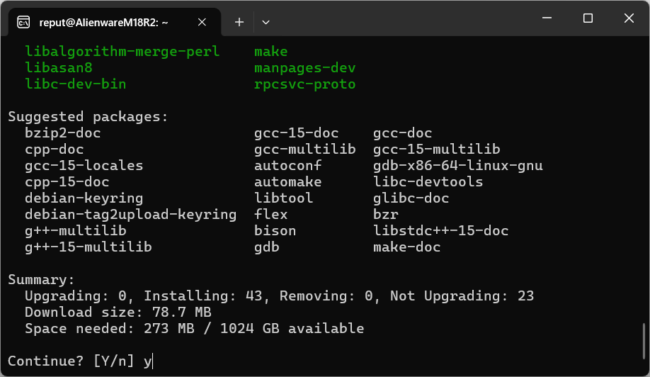

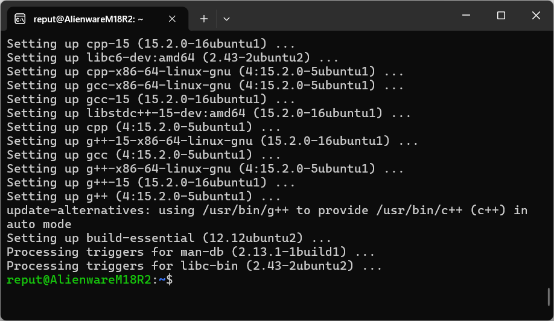

これで GCC を使う準備ができました。


## 5. gcc が使えるか確認する

`build-essential` をインストールすると、C 言語のコードをコンパイルするための `gcc`（ジーシーシー）というコマンドが使えるようになります。

Ubuntu のターミナルで次のコマンドを実行します。

```sh title="GCC のバージョンを確認するコマンド"
gcc --version
```

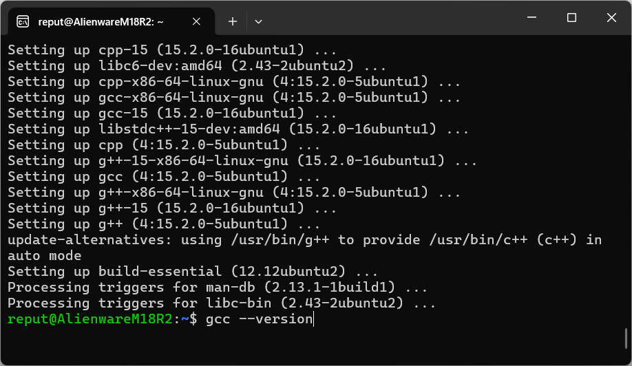

---

次のように、バージョン情報が表示されれば準備完了です。

```txt
gcc (Ubuntu ...) ...
```

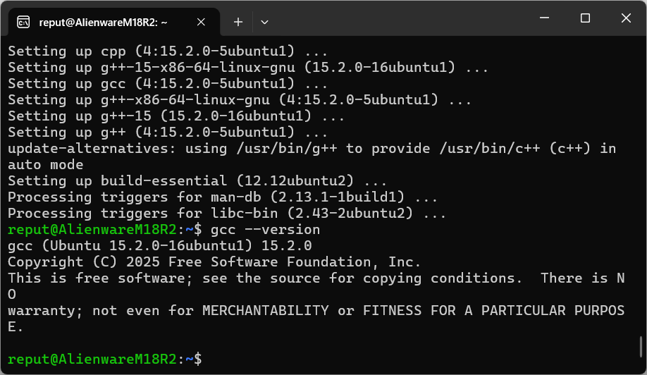


例えば GCC 15 の場合は、次のように表示されます。2026 年 5 月時点では GCC 15 が最新版です。

```txt
gcc (Ubuntu 15.2.0-16ubuntu1) 15.2.0
```

GCC 14 以降の場合は、コードのコンパイルをする際に `-std=c23` を指定することになります。GCC 13 の場合は `-std=c2x` を指定することになります。


## 6. Visual Studio Code をインストールする

Visual Studio Code は、Windows 側にインストールします。

1. [Visual Studio Code :material-open-in-new:](https://code.visualstudio.com/){:target="_blank"} の公式サイトを開きます
2. Windows 版のインストーラーをダウンロードします
3. ダウンロードしたインストーラーを実行します
4. 画面の指示に従ってインストールします
5. Visual Studio Code を起動します


## 7. Visual Studio Code を日本語化する

Visual Studio Code は、インストール直後は英語のインターフェースになっていることがあります。次の手順で日本語化できます。

1. Visual Studio Code 左側の **Extensions** アイコンをクリックします
2. 検索欄に `Japanese Language Pack` と入力します  
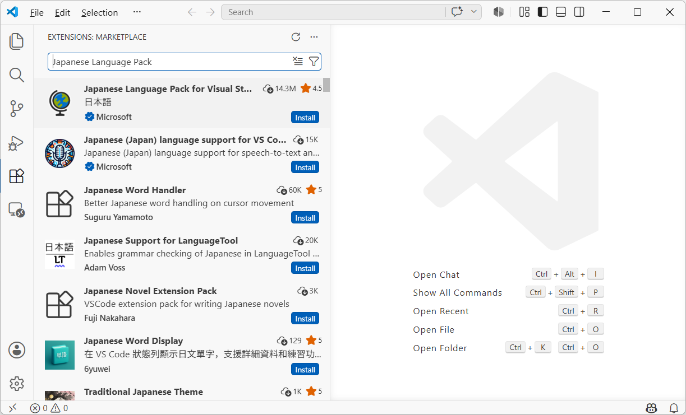
3. Microsoft の **Japanese Language Pack for Visual Studio Code** を選択します
4. **Install** を押します  
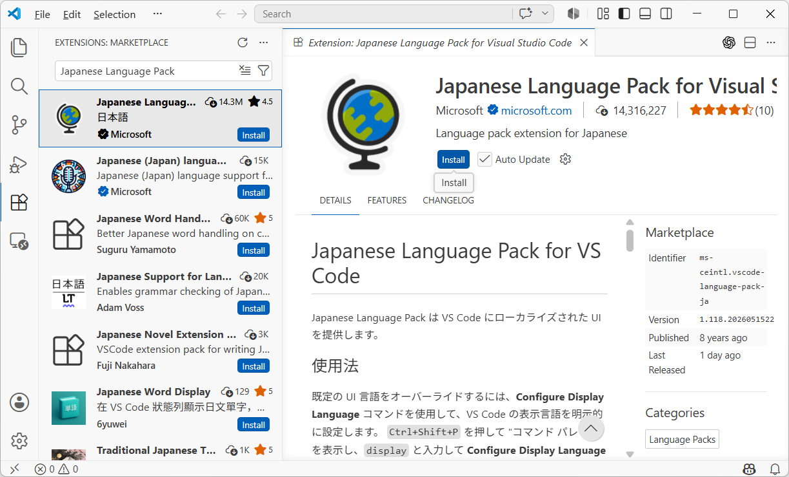
5. 再起動を促すメッセージが表示されたら、Visual Studio Code を再起動します  
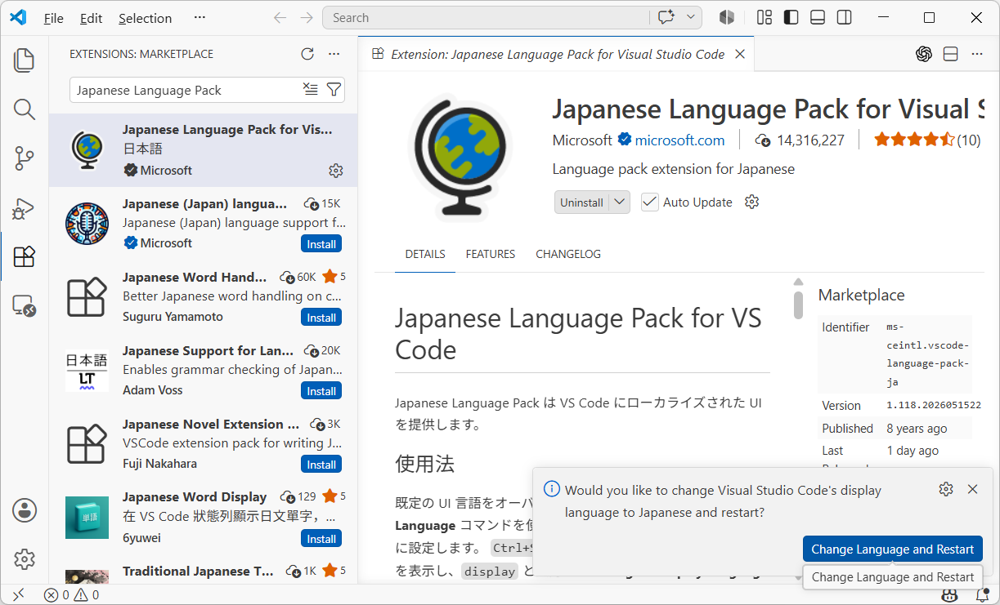


## 8. WSL 拡張機能をインストールする

Visual Studio Code から WSL2 上の Ubuntu を扱えるようにするために、WSL 拡張機能をインストールします。

1. Visual Studio Code 左側の「拡張機能」アイコンをクリックします
2. 検索欄に `WSL` と入力します
3. Microsoft の **WSL** を選択します
4. 「インストール」を押します  
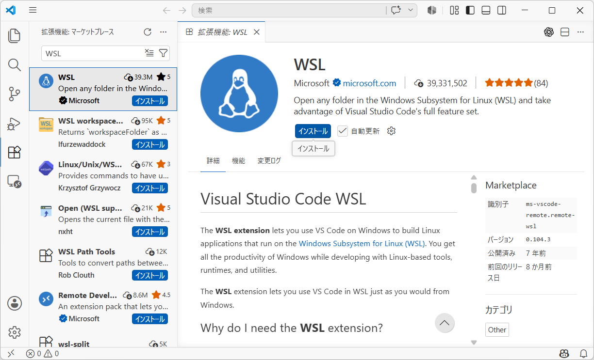


## 9. C/C++ 拡張機能をインストールする

Visual Studio Code で C 言語のコードを扱いやすくするために、C/C++ 拡張機能をインストールします。

1. Visual Studio Code 左側の「拡張機能」アイコンをクリックします
2. 検索欄に `C/C++` と入力します
3. Microsoft の「**C/C++**」または「**C/C++ Extension Pack**」を選択します（どちらを選んでも構いません。後者はいくつか追加の拡張機能が含まれています）
4. 「インストール」を押します  
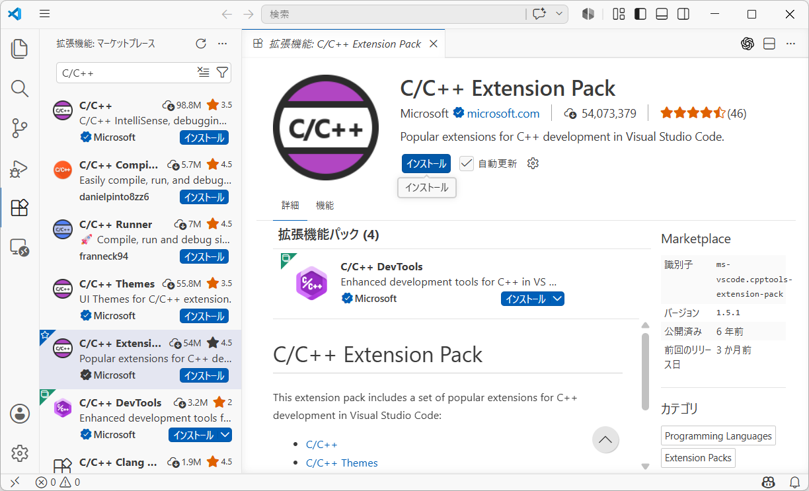

ここでインストールした拡張機能は、Windows 側の Visual Studio Code に対するものです。このあとの手順で、WSL2 上の Ubuntu 側の Visual Studio Code でも同じ拡張機能をインストールすることになります。


## 10. 作業用フォルダを作る

C 言語のファイルを保存するためのフォルダを、WSL2 上の Ubuntu の中に作ります。

Ubuntu のターミナルで次のコマンドを実行します。

```sh title="「c-practice」という名前の作業用フォルダを作るコマンド"
mkdir -p ~/c-practice
```

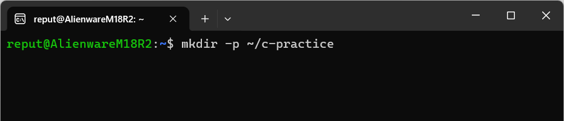

---

次に、`c-practice` フォルダの中へ移動します。

```sh title="先ほど作成した「c-practice」というフォルダに移動するコマンド"
cd ~/c-practice
```

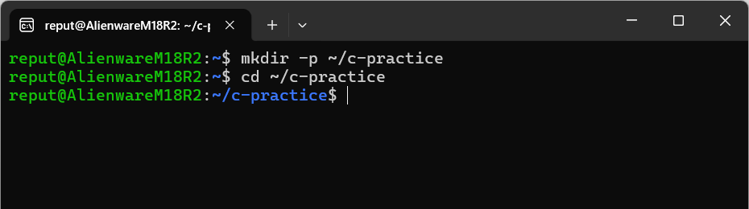

---

移動が完了したら、次のコマンドで、Visual Studio Code から Ubuntu 上の `c-practice` フォルダを開きます。

```sh title="現在のフォルダを Visual Studio Code で開くコマンド"
code .
```

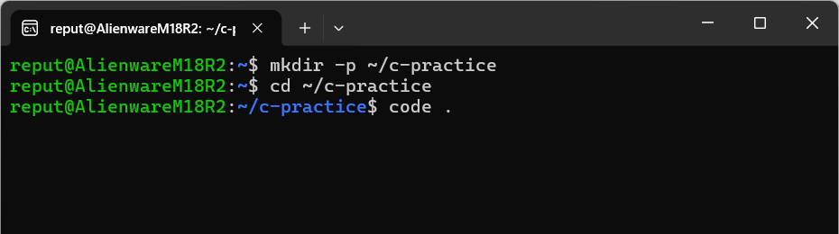

初回は、Visual Studio Code が WSL 用の準備を行うため、少し時間がかかることがあります。

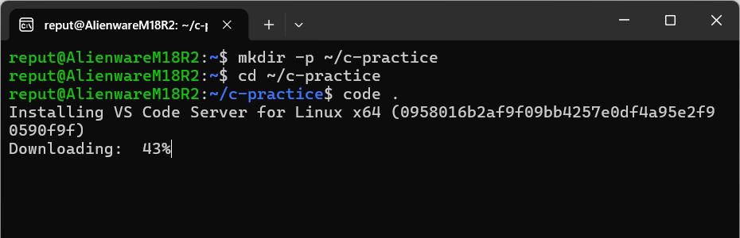

---

起動した Visual Studio Code の左下に `WSL: Ubuntu` のように表示されていれば、WSL2 上の Ubuntu に接続できています。

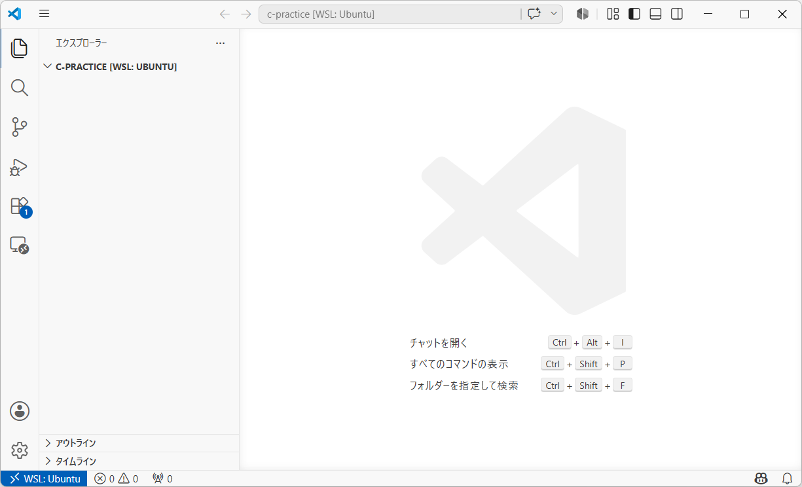

!!!info "ファイルを置く場所"
	WSL2 で C 言語を学習する場合は、`C:\Users\...` のような Windows 側のフォルダではなく、`~/c-practice` のような Ubuntu 側のフォルダにファイルを置くことになります。


## 11. Ubuntu 上の Visual Studio Code に各種拡張機能をインストールする

Visual Studio Code 左側の「拡張機能」アイコンをクリックします。

「ローカル - インストール済み」欄にある一部の拡張機能に「WSL: Ubuntu にインストール」という青いボタンが表示されているはずです。

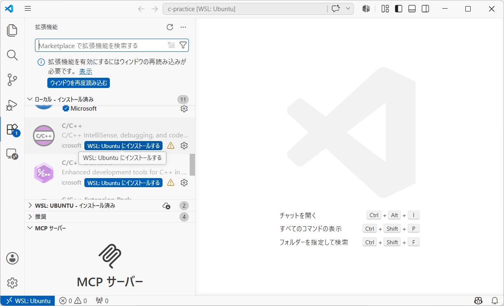

これを一通り押して、WSL2 上の Ubuntu 側の Visual Studio Code にも、先ほどの拡張機能をインストールした状態にします。

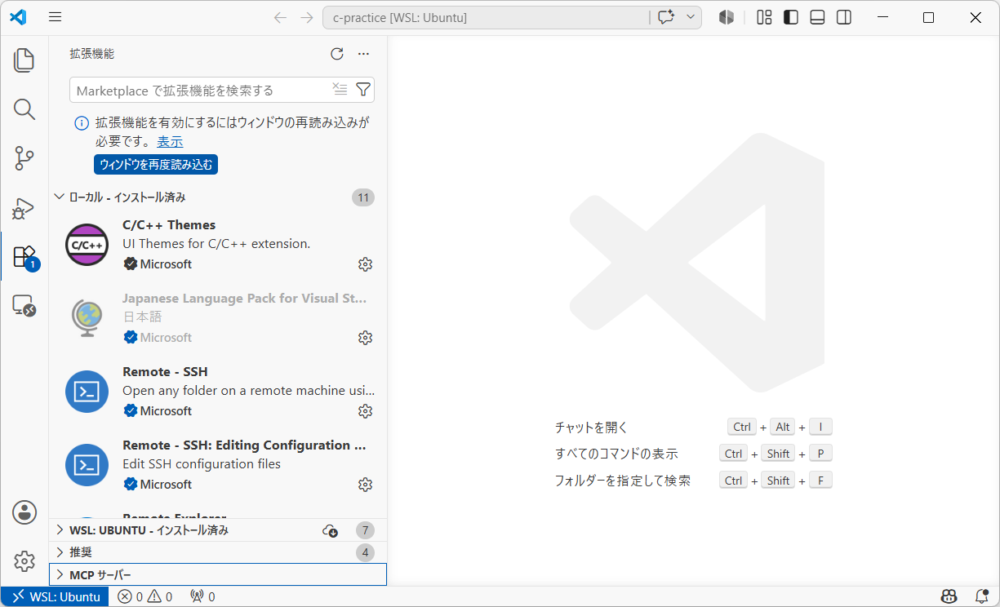

「ウィンドウを再度読み込む」というメッセージが表示されていたら、それをクリックします。自動的に Visual Studio Code が再起動します。


## 12. 最初の C プログラムを書く

Visual Studio Code 左側の「エクスプローラー」アイコンをクリックし、エクスプローラーを表示します。

ここには「c-practice」フォルダの中身が表示されます。初期状態では何もありません。

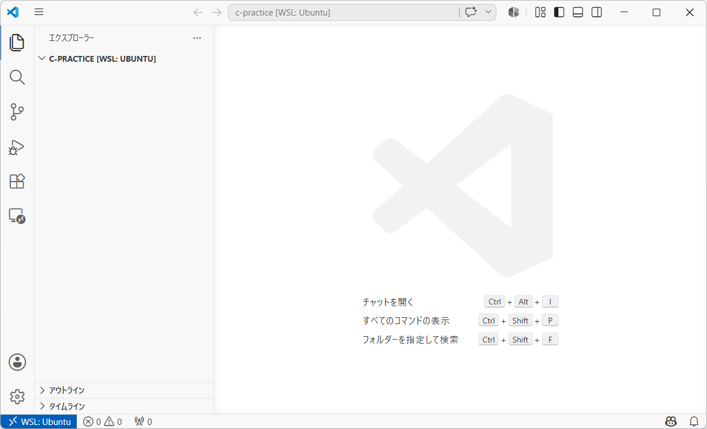

---

`c-practice` フォルダの中に、`hello.c` という名前のファイルを作成します。

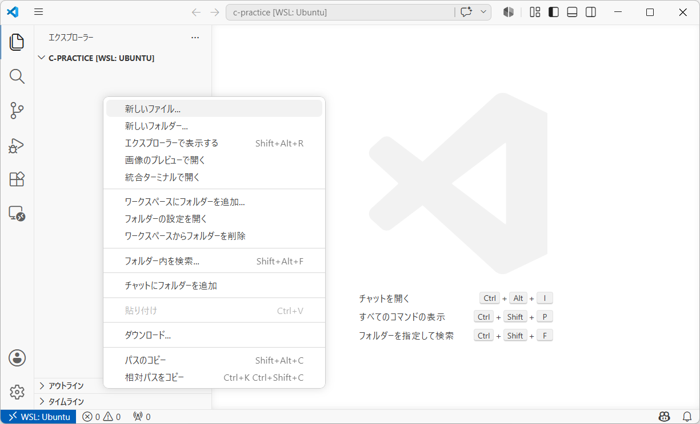

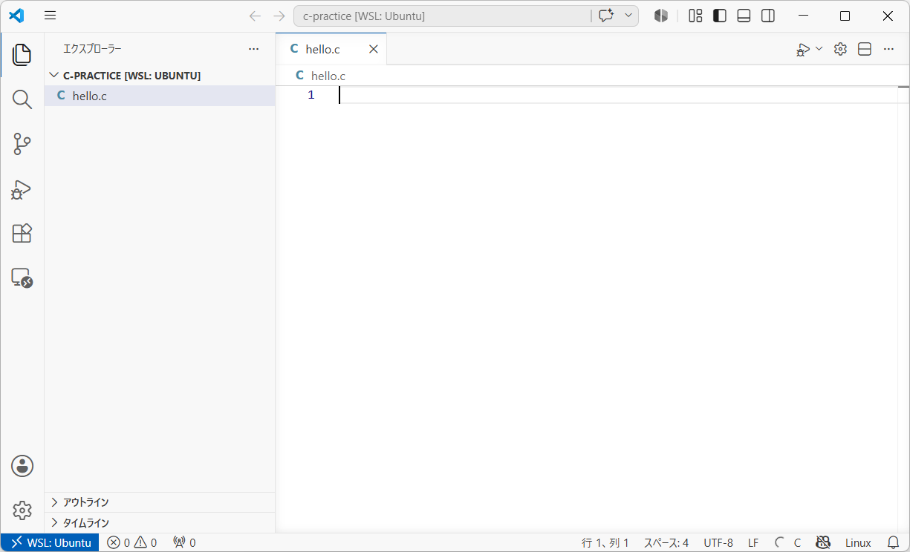

---

`hello.c` に、次のコードを書いてみましょう。

```c title="hello.c"
#include <stdio.h>

int main()
{
	puts("Apple");
	puts("Banana");
}
```

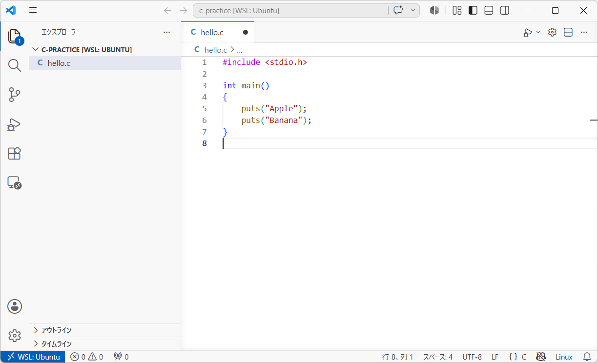


「hello.c」のタブに黒丸 ● が表示されている場合は、まだ保存されていない状態です。++control+s++ キーを押して、変更内容を保存します。


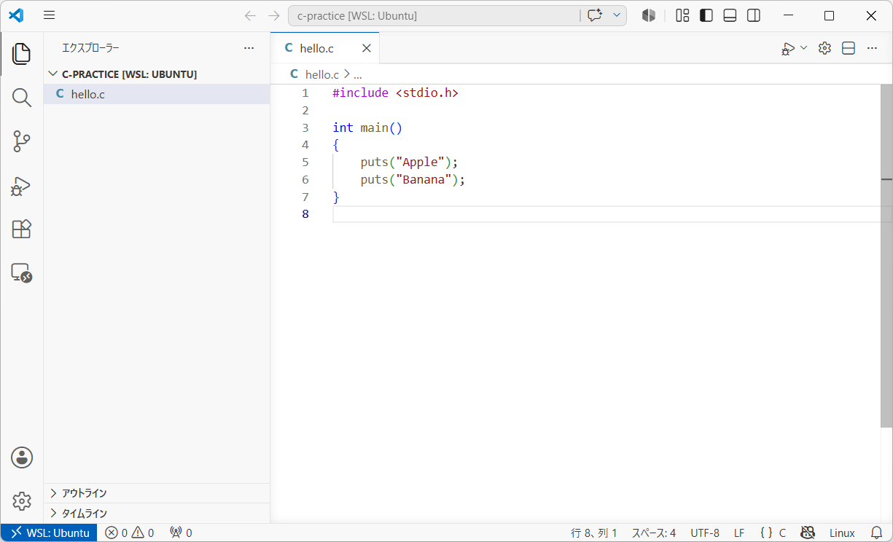


今保存したコードが、画面に `Apple` と `Banana` を表示するプログラムになります。


## 13. コンパイルして実行する

Visual Studio Code のメニューから「表示」→「ターミナル」を選びます。

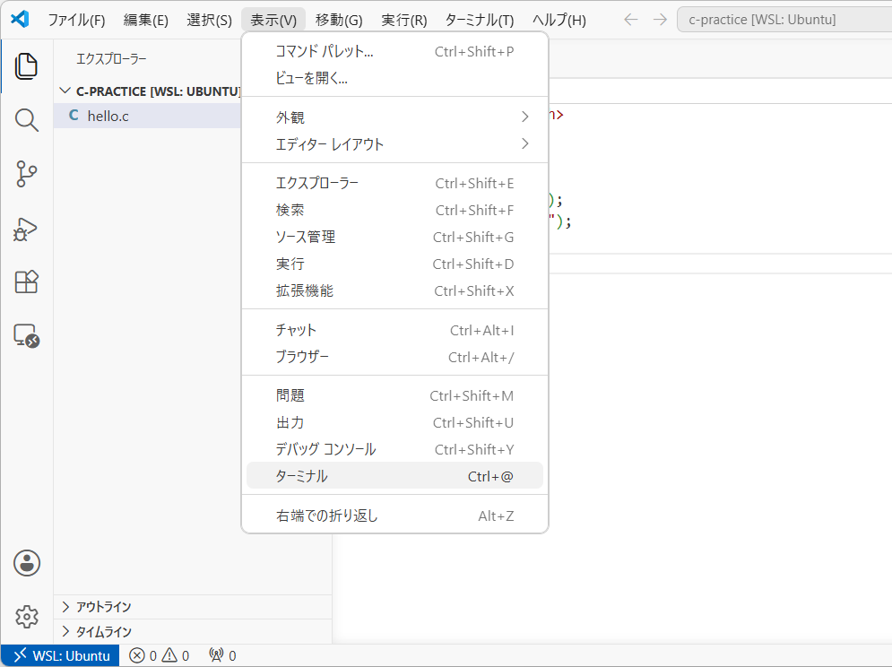

---

画面下にターミナルが表示されます。

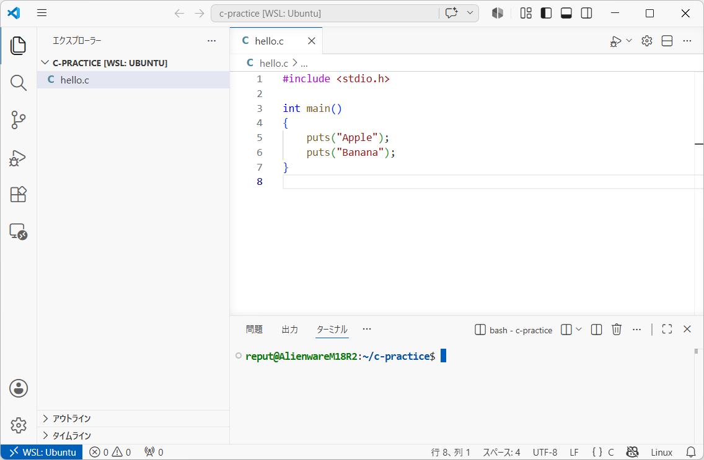


左下に `WSL: Ubuntu` と表示されている状態のウィンドウで開いたターミナルであれば、Ubuntu のターミナルとして使えます。

---

ターミナルに、GCC のバージョンに応じて次のいずれかのコマンドを入力し、プログラムをコンパイルします。

=== "GCC 14 以降を使っている場合"

	```sh title="GCC 14 以降で hello.c をコンパイルするコマンド"
	gcc -std=c23 hello.c
	```

=== "GCC 13 を使っている場合"

	```sh title="GCC 13 で hello.c をコンパイルするコマンド"
	gcc -std=c2x hello.c
	```


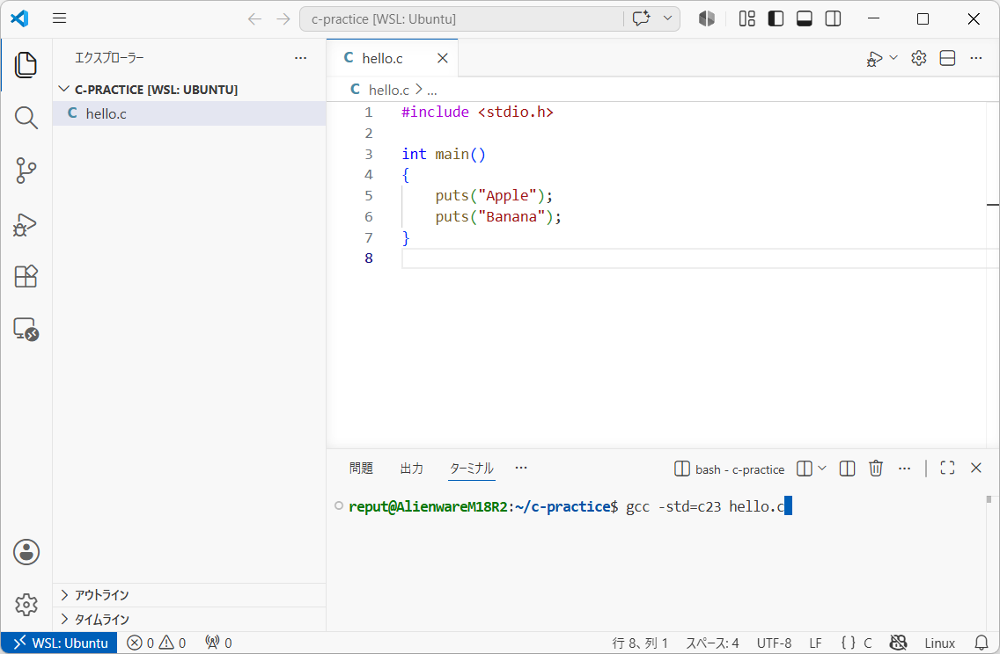

---

コンパイルに成功すると、`a.out` という実行ファイルが作られます。エクスプローラー上でも `a.out` を確認できます。

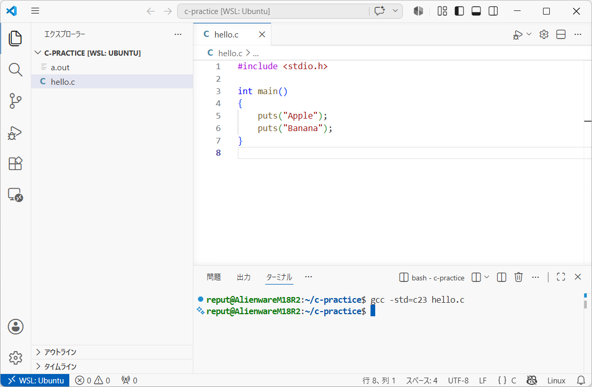

---

次のコマンドで実行します。

```sh title="hello.c をコンパイルしてできた実行ファイル a.out を実行するコマンド"
./a.out
```

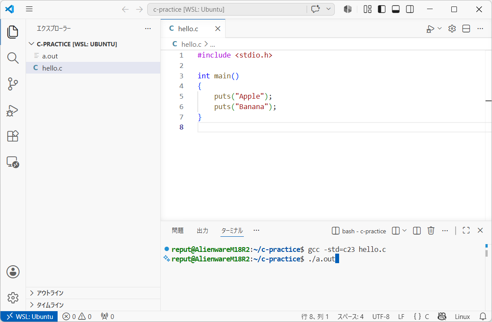

---

ターミナル内に次のように表示されれば成功です。

```txt title="出力"
Apple
Banana
```

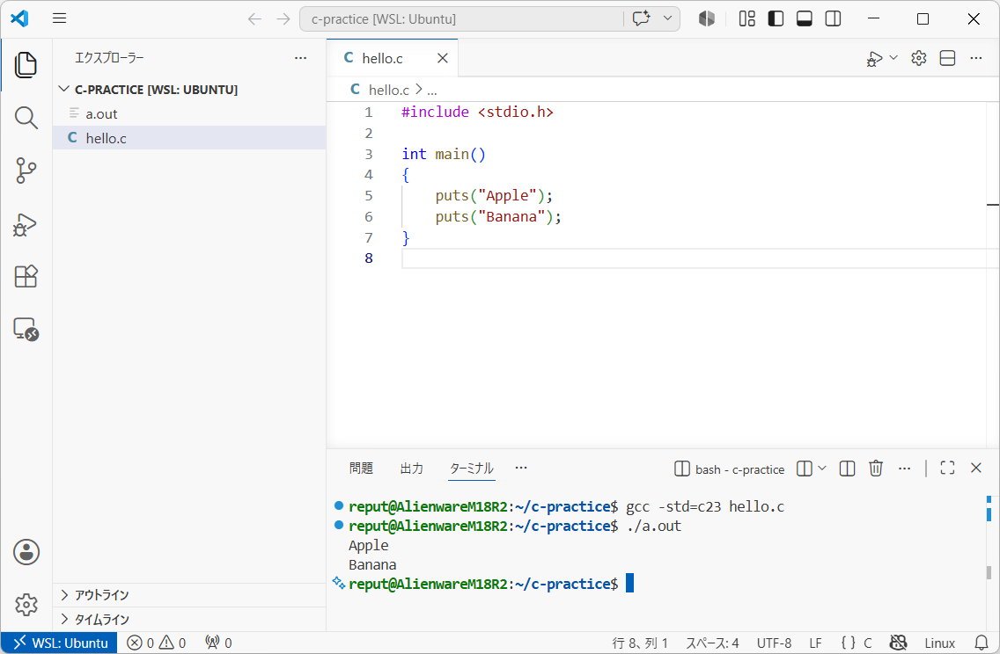


## 14. 入力を扱うプログラムを実行する

次のプログラムは、商品の価格と支払金額を入力し、おつりを計算します。

`hello.c` の内容を次のコードに書き換えて保存します。

```c title="hello.c"
#include <stdio.h>

int main()
{
	printf("商品の価格（円）を入力してください >\n");
	int price;
	scanf("%d", &price);

	printf("支払った金額（円）を入力してください >\n");
	int payment;
	scanf("%d", &payment);

	int change = payment - price;

	if (change < 0)
	{
		puts("支払金額が不足しています");
	}
	else
	{
		printf("おつり: %d 円\n", change);
	}
}
```

コンパイルします。

=== "GCC 14 以降を使っている場合"

	```sh title="GCC 14 以降で hello.c をコンパイルするコマンド"
	gcc -std=c23 hello.c
	```

=== "GCC 13 を使っている場合"

	```sh title="GCC 13 で hello.c をコンパイルするコマンド"
	gcc -std=c2x hello.c
	```

実行します。

```sh title="hello.c をコンパイルしてできた実行ファイル a.out を実行するコマンド"
./a.out
```

実行中に入力を求められたら、数字を入力して Enter キーを押します。

```txt title="入力例"
商品の価格（円）を入力してください >
880
支払った金額（円）を入力してください >
1000
おつり: 120 円
```

WSL2 上の Ubuntu では、実行中のプログラムに対してキーボードから直接入力できます。


## 15. 作業を終える・再開する

作業を終えるときは、Visual Studio Code を閉じます。

---

次に作業を再開するときは、Visual Studio Code を起動し、左下の「リモート ウィンドウを開きます」アイコンをクリックします。

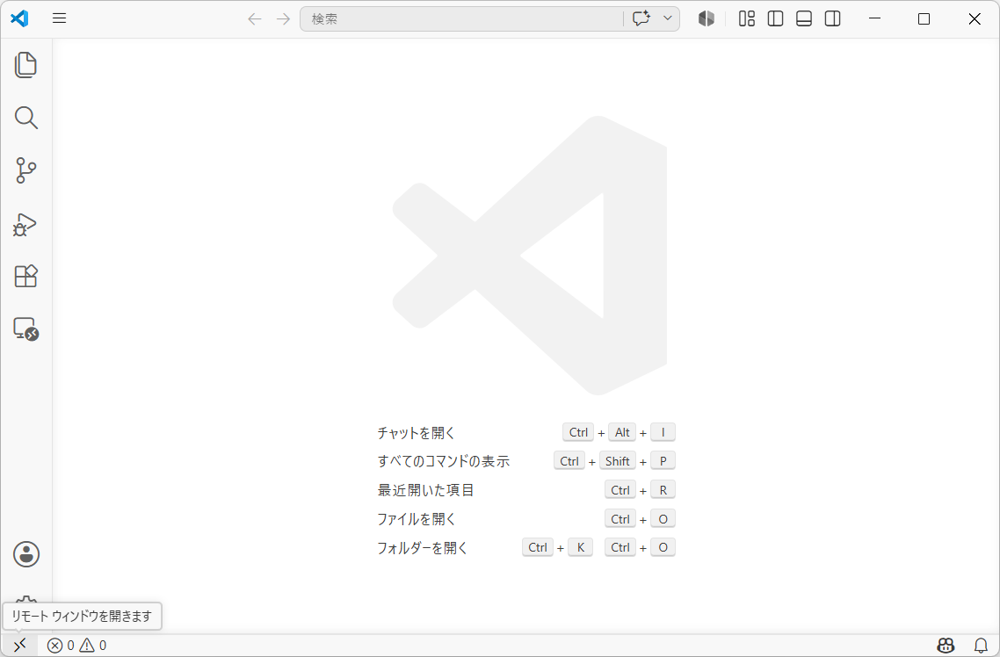

---

次のようなメニューが表示されるので、**WSL への接続** を選択します。

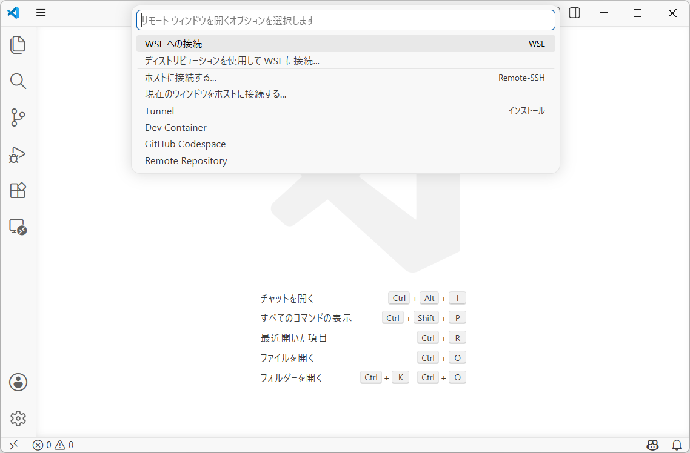

---

WSL2 上の Ubuntu が起動し、Visual Studio Code が接続されます。左下に `WSL: Ubuntu` と表示されていれば、WSL2 上の Ubuntu に接続できています。

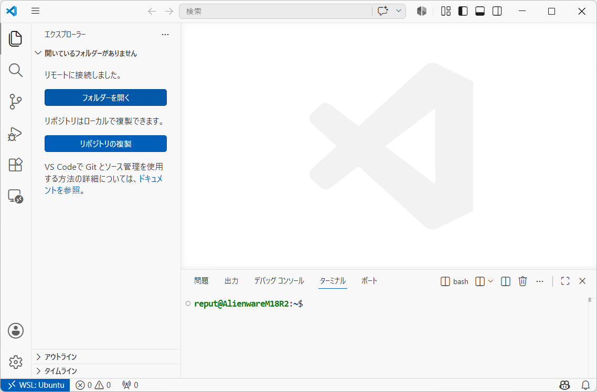

続けて、エクスプローラー上の「フォルダーを開く」から、前回作業した `c-practice` フォルダを選択して「OK」を押します。

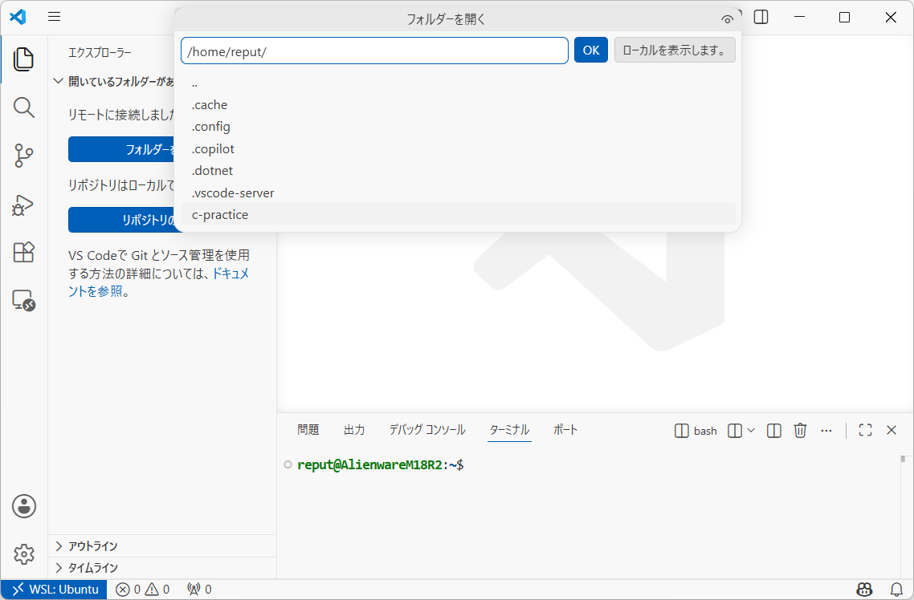

---

これで、前回の続きから作業を再開できます。

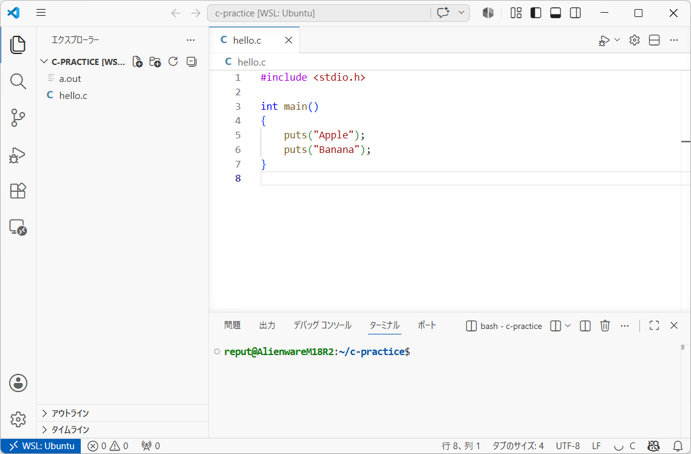


## 16. おすすめのコンパイルコマンド

コンパイラ・オプションの意味は [**付録 3. コンパイラ・オプション**](../appendix/compiler-options.md) を参照してください。

=== "GCC 14 以降"
	```txt title="コンパイルコマンド"
	gcc -Wall -Wextra -Wvla -Wstrict-prototypes -Wconversion -Wshadow -pedantic -std=c23 hello.c -lm
	```

=== "GCC 13"
	```txt title="コンパイルコマンド"
	gcc -Wall -Wextra -Wvla -Wstrict-prototypes -Wconversion -Wshadow -pedantic -std=c2x hello.c -lm
	```


## 17. よくあるトラブルと対処

??? question "`wsl` が見つからない、または `wsl --install` が使えない"

	Windows のバージョンが古い可能性があります。

	Windows Update を実行してから、もう一度 `wsl --install` を試してください。

??? question "Ubuntu のパスワードを入力しても画面に表示されない"

	Ubuntu のターミナルでは、パスワード入力中の文字は表示されません。

	何も入力されていないように見えても、実際には入力されています。パスワードを入力して ++enter++ キーを押してください。

??? question "`gcc: command not found` と表示される"

	```txt title="エラーメッセージ"
	gcc: command not found
	```

	GCC がインストールされていない可能性があります。

	Ubuntu のターミナルで次のコマンドを実行します。

	```sh
	sudo apt update
	sudo apt install build-essential
	```

??? question "`code: command not found` と表示される"

	```txt title="エラーメッセージ"
	code: command not found
	```

	Visual Studio Code が Windows 側にインストールされていないか、WSL から `code` コマンドを使う準備がまだできていない可能性があります。

	Windows 側で Visual Studio Code と WSL 拡張機能をインストールしてから、Ubuntu のターミナルを開き直してください。

??? question "Visual Studio Code の左下に `WSL: Ubuntu` と表示されない"

	Windows 側のフォルダをそのまま開いている可能性があります。

	Ubuntu のターミナルで次のコマンドを実行して、WSL2 上のフォルダを Visual Studio Code で開きます。

	```sh
	cd ~/c-practice
	code .
	```

??? question "`hello.c: No such file or directory` と表示される"

	```txt title="エラーメッセージ"
	cc1: fatal error: hello.c: No such file or directory
	compilation terminated.
	```

	ターミナルで開いているフォルダに `hello.c` がありません。

	Visual Studio Code で `hello.c` を保存したフォルダを開いているか確認してください。

??? question "`a.out: command not found` と表示される"

	```txt title="エラーメッセージ"
	a.out: command not found
	```

	実行するときは、ファイル名の前に `./` を付けます。

	```sh title="誤った実行方法"
	a.out
	```

	```sh title="正しい実行方法"
	./a.out
	```

??? question "`invalid value 'c23' in '-std=c23'` と表示される"

	```txt title="エラーメッセージ"
	gcc: error: unrecognized command-line option '-std=c23'
	```

	使用している GCC が `-std=c23` に対応していない可能性があります。

	次のコマンドでバージョンを確認します。

	```sh
	gcc --version
	```

	GCC 13 を使っている場合は、`-std=c23` の代わりに `-std=c2x` を指定します。

	```sh
	gcc -std=c2x hello.c
	```
